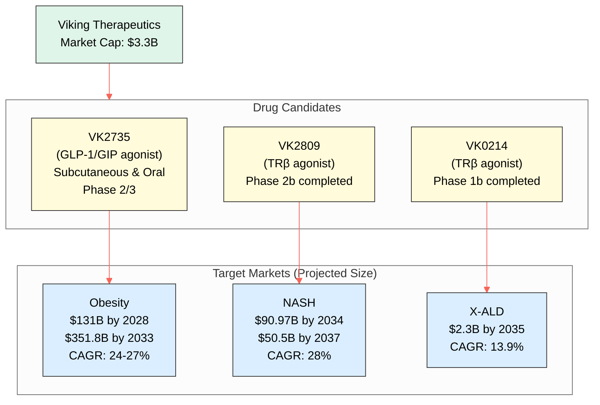
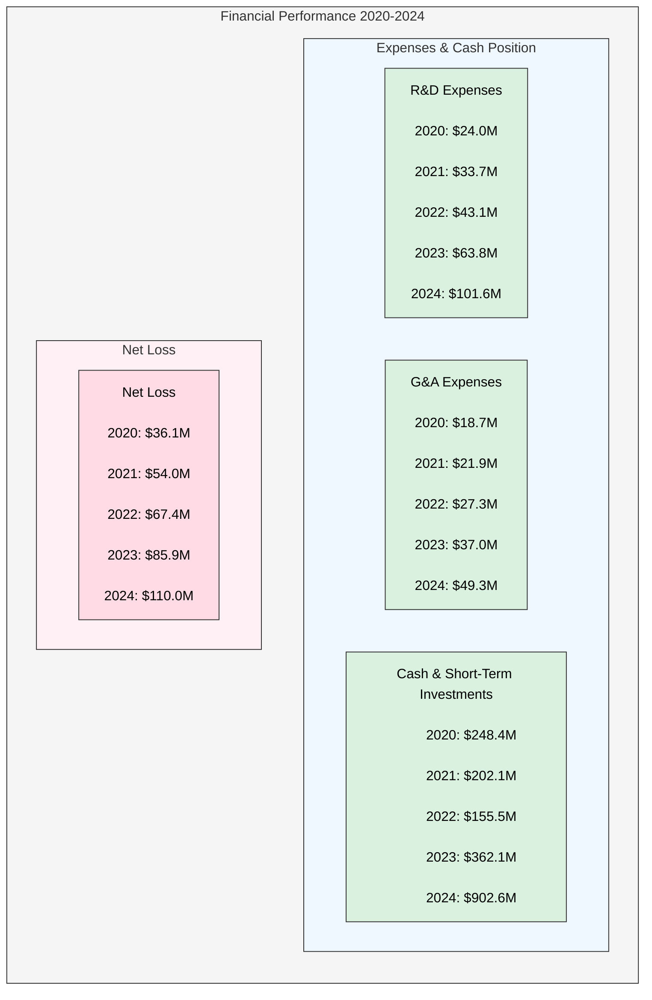

# **Due Diligence Report for Viking Therapeutics**

## **1. Company Overview**

Viking Therapeutics, Inc. (NASDAQ: VKTX) is a clinical-stage biopharmaceutical company headquartered in San Diego, California. The company focuses on developing novel therapeutics for metabolic and endocrine disorders, with a specialized approach that potentially provides a competitive advantage through deep understanding of disease mechanisms and targeted drug development strategies.

### **Core Business Focus**
- **Therapeutic Areas**: Metabolic and endocrine disorders
- **Key Indications**: Obesity, non-alcoholic steatohepatitis (NASH/MASH), Type 2 Diabetes, X-linked adrenoleukodystrophy (X-ALD), and others
- **Development Strategy**: Multiple formulations (oral and subcutaneous) for lead candidates to broaden patient reach

### **Key Management Team**

| Executive | Position | Experience |
|-----------|----------|------------|
| Brian Lian, Ph.D. | President & CEO | Extensive biotech equity research, prior scientific roles at Amgen and Microcide Pharmaceuticals |
| Marianne Mancini | Chief Operating Officer | Over 30 years in clinical trials management and oversight |
| Greg Zante | Chief Financial Officer | Nearly 25 years of financial management in biotech |
| Geoffrey Barker, Ph.D. | Chief Development Officer | Over 23 years in pharmaceutical and nonclinical development |
| Michael Morneau | VP, Finance & Administration | Over 20 years of accounting and financial experience in biotech |

### **Company History**

- **Founded**: 2012
- **IPO**: 2015 on NASDAQ (raised approximately $63.3 million)
- **Initial Focus**: Type 2 diabetes, later expanded to other metabolic and endocrine disorders
- **Recent Milestones**:
  - 2023: Positive Phase 1 results for lead candidate VK2735
  - 2024: Positive Phase 2 results for VK2735 in obesity treatment
  - 2025 (Jan): Initiated Phase 2 VENTURE-Oral Dosing Trial of VK2735
  - 2025 (Mar): Signed manufacturing agreement with CordenPharma
  - 2025 (Q2, Planned): Initiation of Phase 3 trials for subcutaneous VK2735

### **Business Model**

Currently operating as a clinical-stage entity with:
- No commercial products yet on market
- Revenue primarily through research services and potential licensing agreements
- Capital raised through public stock offerings, private placements, and research grants
- Future revenue potential lies in commercial sales of drug candidates upon regulatory approval
- Active exploration of strategic partnerships and collaborations

## **2. Pipeline Analysis**

Viking's pipeline consists of several promising drug candidates targeting metabolic and endocrine disorders in various stages of clinical development.

```mermaid
gantt
    title Viking Therapeutics Pipeline Development Timeline
    dateFormat  YYYY-Q1
    axisFormat %Y-%b
    section VK2735 (Obesity)
    Subcutaneous Phase 1                :done, sub_p1, 2022-Q1, 2023-Q1
    Subcutaneous Phase 2 VENTURE        :done, sub_p2, 2023-Q3, 2024-Q4
    Subcutaneous Phase 3 (Planned)      :       sub_p3, 2025-Q2, 2026-Q4
    Oral Phase 1                        :done, oral_p1, 2023-Q2, 2024-Q2
    Oral Phase 2 VENTURE-Oral          :active, oral_p2, 2025-Q1, 2025-Q3
    section VK2809 (NASH)
    Phase 2b VOYAGE                     :done, nash_p2, 2019-Q4, 2024-Q2
    Phase 3 (Potential)                 :       nash_p3, 2026-Q1, 2027-Q4
    section VK0214 (X-ALD)
    Phase 1b                            :done, xald_p1, 2022-Q3, 2024-Q3
    Phase 2 (Potential)                 :       xald_p2, 2025-Q4, 2026-Q4
```

### **VK2735 (Dual GLP-1/GIP agonist)**

**Target Indication**: Obesity and metabolic disorders

**Formulations & Status**:
- **Subcutaneous**: Completed Phase 2 VENTURE study; Phase 3 planned for Q2 2025
- **Oral**: Currently in Phase 2 VENTURE-Oral Dosing Trial; data expected H2 2025

**Clinical Results**:
- **Subcutaneous**: Up to 14.7% reduction in mean body weight from baseline and up to 13.1% reduction relative to placebo in Phase 2 VENTURE trial
- **Oral**: Phase 1 trial showed dose-dependent reductions in mean body weight of up to 8.2% with encouraging safety profile

### **VK2809 (TRβ Agonist)**

**Target Indication**: NASH/MASH and lipid disorders

**Status**: Phase 2b VOYAGE study for NASH and fibrosis completed; evaluating next steps

**Clinical Results**:
- 37% to 55% mean relative reduction in liver fat
- 63% to 75% NASH resolution rates after 52 weeks
- Improvements in fibrosis and plasma lipids

### **VK0214 (TRβ Agonist)**

**Target Indication**: X-linked adrenoleukodystrophy (X-ALD)

**Status**: Phase 1b study in AMN form of X-ALD completed; exploring next steps

**Clinical Results**:
- Demonstrated safety and tolerability
- Significant reductions in plasma levels of very long-chain fatty acids (VLCFAs) and other lipids

### **Competitive Landscape**

**Obesity Market Competitors**:
- Novo Nordisk (Wegovy, Ozempic, Rybelsus)
- Eli Lilly (Zepbound, Mounjaro, orforglipron)
- Pfizer, Boehringer Ingelheim, Rhythm Pharmaceuticals, and others

**NASH Market Competitors**:
- Madrigal Pharmaceuticals (Rezdiffra - first approved NASH therapy)
- Eli Lilly, Intercept Pharmaceuticals, Inventiva Pharma, Gilead Sciences, and others

**X-ALD Market Competitors**:
- Bluebird Bio (Skysona)
- Minoryx Therapeutics (Leriglitazone)
- Others including SwanBio Therapeutics, Autobahn Therapeutics

## **3. Market Analysis**

### **Target Market Sizes**



| Market | Current Size | Projected Size | CAGR | 
|--------|--------------|----------------|------|
| Obesity (Global) | $24B (2023) | $131B (2028) | 24-27% |
| Obesity (Global) | $140.3B (2023) | $351.8B (2033) | 9.8% |
| Obesity (US) | $15.92B (2024) | $60.53B (2030) | 22.31% |
| NASH (Global) | $7.70B (2024) | $90.97B (2034) | 28.0% |
| NASH (Global) | $6.16B (2024) | $50.5B (2037) | 18.2% |
| X-ALD (Global) | $0.52B (2024) | $2.3B (2035) | 13.9% |

### **Patient Population**
- **Obesity**: Over 40% of US adults (>100 million individuals)
- **NASH**: Estimated 1.5% to 6.5% of US adults (9-15 million people)
- **X-ALD**: Birth prevalence of 1/17,000; US prevalence in males estimated at 1 in 21,000

### **Pricing Benchmarks**
- **Obesity Treatments**:
  - Wegovy: ~$1,349/month (list price); $499/month through NovoCare
  - Zepbound: $1,086.37 per fill (list price)
- **NASH Treatment**:
  - Rezdiffra: $47,400 annual cost
- **X-ALD Treatment**:
  - Skysona (gene therapy): $3 million per dose

## **4. Financial Review**

### **Current Financial Position**
- **Cash Position**: $903 million (as of December 31, 2024)
- **Burn Rate**:
  - R&D Expenses: $31.0 million (Q4 2024); $101.6 million (FY 2024)
  - G&A Expenses: $15.3 million (Q4 2024); $49.3 million (FY 2024)
- **Net Loss**: $109.96 million (FY 2024)
- **Revenue**: No revenue reported for 2024

### **Historical Financial Performance**



| Financial Data (Year Ended December 31) | 2024 ($M) | 2023 ($M) | 2022 ($M) | 2021 ($M) | 2020 ($M) |
|----------------------------------------|-----------|-----------|-----------|-----------|-----------|
| Revenue | $0.00 | $0.00 | $0.00 | $0.00 | $0.00 |
| Research and Development Expenses | $101.6 | $63.8 | $43.1 | $33.7 | $24.0 |
| General and Administrative Expenses | $49.3 | $37.0 | $27.3 | $21.9 | $18.7 |
| Net Loss | -$109.96 | -$85.89 | -$67.38 | -$54.00 | -$36.05 |
| Cash and Short-Term Investments | $902.61 | $362.08 | $155.49 | $202.10 | $248.39 |

### **Funding Requirements**
- Prepayments totaling $150 million to CordenPharma between 2025-2028
- Current cash position ($903 million) expected to support clinical development including Phase 3 trials for VK2735

## **5. Risk Assessment**

```mermaid
%%{init: {'theme': 'neutral', 'themeVariables': { 'primaryColor': '#597ef7', 'primaryTextColor': '#fff', 'primaryBorderColor': '#597ef7', 'lineColor': '#f76559', 'secondaryColor': '#41BF89', 'tertiaryColor': '#f1f1f1'}}}%%
graph TD
    Risk["Viking Therapeutics<br/>Risk Assessment"]
    
    Clinical["Clinical Risks"]
    Regulatory["Regulatory Risks"]
    Commercial["Commercial Risks"]
    Financial["Financial Risks"]
    
    Risk --> Clinical
    Risk --> Regulatory
    Risk --> Commercial
    Risk --> Financial
    
    Clinical --> C1["Trial endpoints<br/>not met"]
    Clinical --> C2["Safety/tolerability<br/>issues"]
    Clinical --> C3["Trial delays"]
    
    Regulatory --> R1["Approval<br/>uncertainty"]
    Regulatory --> R2["Potential for<br/>clinical holds"]
    Regulatory --> R3["Changing regulatory<br/>requirements"]
    
    Commercial --> M1["Market adoption<br/>uncertainty"]
    Commercial --> M2["Strong competition<br/>in target markets"]
    Commercial --> M3["Pricing &<br/>reimbursement<br/>challenges"]
    Commercial --> M4["Supply chain<br/>disruptions"]
    
    Financial --> F1["Operating at<br/>net loss"]
    Financial --> F2["External funding<br/>dependence"]
    Financial --> F3["Potential future<br/>shareholder dilution"]
    Financial --> F4["$150M manufacturing<br/>commitment"]
    
    classDef riskNode fill:#ffeeee,stroke:#990000,stroke-width:1px
    classDef riskCategory fill:#f5f5ff,stroke:#333,stroke-width:1px
    classDef clinicalRisk fill:#ffdddd,stroke:#333,stroke-width:1px
    classDef regulatoryRisk fill:#ddffdd,stroke:#333,stroke-width:1px
    classDef commercialRisk fill:#ddddff,stroke:#333,stroke-width:1px
    classDef financialRisk fill:#ffffdd,stroke:#333,stroke-width:1px
    
    class Risk riskNode
    class Clinical,Regulatory,Commercial,Financial riskCategory
    class C1,C2,C3 clinicalRisk
    class R1,R2,R3 regulatoryRisk
    class M1,M2,M3,M4 commercialRisk
    class F1,F2,F3,F4 financialRisk
```



### **Clinical Risks**
- Potential failure to meet primary or secondary endpoints in ongoing/future trials
- Safety or tolerability issues (VK2735 showed GI side effects in Phase 2)
- Delays in clinical trial timelines

### **Regulatory Risks**
- No guarantee of regulatory approvals despite positive trial results
- Potential for clinical holds based on competitor experiences
- Changes in regulatory requirements increasing costs or timeline

### **Commercial Risks**
- Uncertain market adoption even if approved
- Substantial competition in obesity and NASH markets
- Pricing pressures and reimbursement challenges
- Potential supply chain disruptions

### **Financial Risks**
- Currently operating at a net loss
- Reliance on external funding
- Potential for shareholder dilution from future stock offerings
- Significant financial commitment to manufacturing ($150M to CordenPharma)

## **6. Investment Analysis**

### **Valuation Metrics**
- **Market Capitalization**: $3.3 billion (as of March 11, 2025)
- **52-Week Trading Range**: $24.41 to $89.10
- **Price to Earnings (P/E) Ratio**: Negative (clinical-stage company)
- **Price to Book (P/B) Ratio**: 4.73 (end of 2023); 6.28 (recent)

### **Comparable Analysis**
- Competitors in obesity market (Novo Nordisk, Eli Lilly) have substantially larger market caps
- Madrigal Pharmaceuticals had market cap of $1.2 billion as of January 2024 (post-Rezdiffra approval)

### **Investment Thesis**

**Strengths**:
- Promising Phase 2 data for VK2735 in large, growing obesity market
- Potential for best-in-class efficacy
- Dual formulation strategy (subcutaneous and oral) broadens market opportunity
- Strong Phase 2b results for VK2809 in NASH
- Promising data for VK0214 in X-ALD (high unmet need)
- Strong cash position for near-term development
- Experienced management team

**Weaknesses**:
- Clinical-stage status with no current product revenue
- High burn rate
- Significant competition in target markets
- Inherent risks of clinical trial failure and regulatory hurdles
- Potential for future stock dilution

### **Risk Rating**: High (clinical-stage biotech)

### **Potential Catalysts**
- Phase 3 trial results for VK2735 subcutaneous formulation
- Phase 2 data for oral VK2735
- Regulatory developments for competitors
- Potential for strategic partnerships or acquisition

## **7. Conclusion and Recommendations**

Viking Therapeutics presents a compelling investment opportunity within the biotechnology sector, primarily driven by the promising clinical development of its lead drug candidate, VK2735, for obesity. The Phase 2 VENTURE trial demonstrated significant weight loss with both subcutaneous and oral formulations, positioning VK2735 as a potential competitor in a vast and rapidly expanding market.

The company's second lead program, VK2809, targeting NASH, has also shown robust Phase 2b results. Given the lack of established treatments for NASH and the significant market size, VK2809 holds substantial potential. Additionally, the Phase 1b results for VK0214 in X-ALD are encouraging for addressing a rare disease with high unmet medical need.

### **Recommendations**:

- **Monitor Clinical Trial Progress**: Closely track progress and results of ongoing Phase 2 oral trial for VK2735 and planned Phase 3 trials for subcutaneous formulation
- **Evaluate Competitive Landscape**: Continuously assess competitors in obesity and NASH markets
- **Assess Regulatory Pathway**: Monitor requirements and potential challenges for approval
- **Track Financial Health**: Watch burn rate, cash position, and financing activities
- **Consider Buyout Potential**: While not a primary investment strategy, potential for acquisition increases with positive Phase 3 data

In conclusion, Viking Therapeutics offers a high-risk, high-reward investment profile. The success of its lead drug candidates in large and underserved markets could generate substantial returns, but investors should be aware of the significant risks involved in biotech drug development.

## **8. Appendix**

### **Competitor Analysis**

| Market | Key Competitors | Lead Products | Status |
|--------|----------------|---------------|--------|
| Obesity | Novo Nordisk | Wegovy, Ozempic | Marketed |
|         | Eli Lilly | Zepbound, Mounjaro | Marketed |
|         | Pfizer | Danuglipron | Clinical Development |
| NASH    | Madrigal | Rezdiffra | FDA Approved |
|         | Eli Lilly | Tirzepatide | Clinical Development |
|         | Intercept | Ocaliva | Clinical Development |
| X-ALD   | Bluebird Bio | Skysona | FDA Approved |
|         | Minoryx | Leriglitazone | Clinical Development |

### **Recent News & Catalysts**

* Manufacturing agreement with CordenPharma (March 2025)
* Initiation of Phase 2 VENTURE-Oral Dosing Trial (January 2025)
* Positive 52-week data from Phase 2b VOYAGE study (2024)
* Phase 1b results for VK0214 in X-ALD (2024)

## **9. References**

1. Stock Information - Viking Therapeutics, accessed March 13, 2025, [https://ir.vikingtherapeutics.com/stock-information](https://ir.vikingtherapeutics.com/stock-information)  
2. Viking Therapeutics - business abc, accessed March 13, 2025, [https://businessabc.net/wiki/viking-therapeutics](https://businessabc.net/wiki/viking-therapeutics)  
3. Viking Therapeutics Home - Viking Therapeutics, accessed March 13, 2025, [https://vikingtherapeutics.com/](https://vikingtherapeutics.com/)  
4. Viking Therapeutics Signs Broad Manufacturing Agreement With CordenPharma to Support Commercialization of VK2735 - PR Newswire, accessed March 13, 2025, [https://www.prnewswire.com/news-releases/viking-therapeutics-signs-broad-manufacturing-agreement-with-cordenpharma-to-support-commercialization-of-vk2735-302397853.html](https://www.prnewswire.com/news-releases/viking-therapeutics-signs-broad-manufacturing-agreement-with-cordenpharma-to-support-commercialization-of-vk2735-302397853.html)  
5. Viking Therapeutics Signs Broad Manufacturing Agreement With CordenPharma to Support Commercialization of VK2735 - Mar 11, 2025, accessed March 13, 2025, [https://ir.vikingtherapeutics.com/2025-03-11-Viking-Therapeutics-Signs-Broad-Manufacturing-Agreement-With-CordenPharma-to-Support-Commercialization-of-VK2735](https://ir.vikingtherapeutics.com/2025-03-11-Viking-Therapeutics-Signs-Broad-Manufacturing-Agreement-With-CordenPharma-to-Support-Commercialization-of-VK2735)  
6. Viking Therapeutics Reports Fourth Quarter and Year-End 2024 Financial Results and Provides Corporate Update - PR Newswire, accessed March 13, 2025, [https://www.prnewswire.com/news-releases/viking-therapeutics-reports-fourth-quarter-and-year-end-2024-financial-results-and-provides-corporate-update-302369377.html](https://www.prnewswire.com/news-releases/viking-therapeutics-reports-fourth-quarter-and-year-end-2024-financial-results-and-provides-corporate-update-302369377.html)  
7. Pipeline Overview - Viking Therapeutics, accessed March 13, 2025, [https://vikingtherapeutics.com/pipeline/overview/](https://vikingtherapeutics.com/pipeline/overview/)  
8. Annual Report for Fiscal Year Ending December 31, 2024 (Form 10-K), accessed March 13, 2025, [https://www.publicnow.com/view/9AFB854ECE2F3C0FD3868D990C63E1D0539E6E30](https://www.publicnow.com/view/9AFB854ECE2F3C0FD3868D990C63E1D0539E6E30)  
9. Viking Therapeutics - Overview, accessed March 13, 2025, [https://ir.vikingtherapeutics.com/](https://ir.vikingtherapeutics.com/)  
10. Viking Therapeutics Reports Fourth Quarter and Year-End 2024 Financial Results and Provides Corporate Update - Feb 5, 2025, accessed March 13, 2025, [https://ir.vikingtherapeutics.com/2025-02-05-Viking-Therapeutics-Reports-Fourth-Quarter-and-Year-End-2024-Financial-Results-and-Provides-Corporate-Update](https://ir.vikingtherapeutics.com/2025-02-05-Viking-Therapeutics-Reports-Fourth-Quarter-and-Year-End-2024-Financial-Results-and-Provides-Corporate-Update)  
11. VK2735 (Subcutaneous & Oral Formulations) Dual GLP-1/GIP Receptor Agonist, accessed March 13, 2025, [https://vikingtherapeutics.com/pipeline/metabolic-disease-program/vk2735/](https://vikingtherapeutics.com/pipeline/metabolic-disease-program/vk2735/)  
12. Management - Viking Therapeutics, accessed March 13, 2025, [https://vikingtherapeutics.com/about/management/](https://vikingtherapeutics.com/about/management/)  
13. Management - Viking Therapeutics, accessed March 13, 2025, [http://ir.vikingtherapeutics.com/management](http://ir.vikingtherapeutics.com/management)  
14. A Brief History of Viking Therapeutics, accessed March 13, 2025, [https://canvasbusinessmodel.com/blogs/brief-history/viking-therapeutics-brief-history](https://canvasbusinessmodel.com/blogs/brief-history/viking-therapeutics-brief-history)  
15. Viking Therapeutics (VKTX) Stock - Research | Financials | Charts (NASDAQ, accessed March 13, 2025, [https://www.financecharts.com/stocks/VKTX](https://www.financecharts.com/stocks/VKTX)  
16. Viking Therapeutics Announces Results from Phase 1 Clinical Trial of Dual GLP-1/GIP Receptor Agonist VK2735 - Mar 28, 2023, accessed March 13, 2025, [https://ir.vikingtherapeutics.com/2023-03-28-Viking-Therapeutics-Announces-Results-from-Phase-1-Clinical-Trial-of-Dual-GLP-1-GIP-Receptor-Agonist-VK2735](https://ir.vikingtherapeutics.com/2023-03-28-Viking-Therapeutics-Announces-Results-from-Phase-1-Clinical-Trial-of-Dual-GLP-1-GIP-Receptor-Agonist-VK2735)  
17. Results of Phase II Clinical Trial Show Promise for Potential Obesity Treatment, accessed March 13, 2025, [https://www.appliedclinicaltrialsonline.com/view/results-of-phase-ii-clinical-trial-show-promise-for-potential-obesity-treatment](https://www.appliedclinicaltrialsonline.com/view/results-of-phase-ii-clinical-trial-show-promise-for-potential-obesity-treatment)  
18. CordenPharma & Viking Therapeutics Sign GLP-1 Supply Contract, accessed March 13, 2025, [https://cordenpharma.com/articles/press-release-cordenpharma-and-viking-therapeutics-sign-long-term-partnership-for-integrated-supply-of-glp-1-peptides-injectables-oral-formulations-for-vk2735/](https://cordenpharma.com/articles/press-release-cordenpharma-and-viking-therapeutics-sign-long-term-partnership-for-integrated-supply-of-glp-1-peptides-injectables-oral-formulations-for-vk2735/)  
19. Press Releases - Viking Therapeutics, accessed March 13, 2025, [https://ir.vikingtherapeutics.com/press-releases](https://ir.vikingtherapeutics.com/press-releases)  
20. Viking Therapeutics Announces Initiation of Phase 2 VENTURE-Oral Dosing Trial of VK2735 Tablet Formulation in Patients with Obesity - Jan 8, 2025, accessed March 13, 2025, [https://ir.vikingtherapeutics.com/2025-01-08-Viking-Therapeutics-Announces-Initiation-of-Phase-2-VENTURE-Oral-Dosing-Trial-of-VK2735-Tablet-Formulation-in-Patients-with-Obesity](https://ir.vikingtherapeutics.com/2025-01-08-Viking-Therapeutics-Announces-Initiation-of-Phase-2-VENTURE-Oral-Dosing-Trial-of-VK2735-Tablet-Formulation-in-Patients-with-Obesity)  
21. Viking Therapeutics begins VK2735 Phase II trial for obesity treatment, accessed March 13, 2025, [https://www.clinicaltrialsarena.com/news/viking-vk2735-ii-trial-obesity/](https://www.clinicaltrialsarena.com/news/viking-vk2735-ii-trial-obesity/)  
22. Viking Therapeutics Announces Initiation of Phase 2 VENTURE-Oral Dosing Trial of VK2735 Tablet Formulation in Patients with Obesity - PR Newswire, accessed March 13, 2025, [https://www.prnewswire.com/news-releases/viking-therapeutics-announces-initiation-of-phase-2-venture-oral-dosing-trial-of-vk2735-tablet-formulation-in-patients-with-obesity-302345159.html](https://www.prnewswire.com/news-releases/viking-therapeutics-announces-initiation-of-phase-2-venture-oral-dosing-trial-of-vk2735-tablet-formulation-in-patients-with-obesity-302345159.html)  
23. Viking Therapeutics Reports Second Quarter 2024 Financial Results and Provides Corporate Update - PR Newswire, accessed March 13, 2025, [https://www.prnewswire.com/news-releases/viking-therapeutics-reports-second-quarter-2024-financial-results-and-provides-corporate-update-302205767.html](https://www.prnewswire.com/news-releases/viking-therapeutics-reports-second-quarter-2024-financial-results-and-provides-corporate-update-302205767.html)  
24. EX-99.1 - SEC.gov, accessed March 13, 2025, [https://www.sec.gov/Archives/edgar/data/1607678/000095017024116642/vktx-ex99_1.htm](https://www.sec.gov/Archives/edgar/data/1607678/000095017024116642/vktx-ex99_1.htm)  
25. VikingTide: Viking Therapeutics Reveals Amazing Clinical Trial Data for VK2735 - On The Pen, accessed March 13, 2025, [https://www.onthepen.com/post/vk2735-vikingtide](https://www.onthepen.com/post/vk2735-vikingtide)  
26. Viking Therapeutics Announces Positive Top-Line Results from Phase 2 VENTURE Trial of Dual GLP-1/GIP Receptor Agonist VK2735 in Patients with Obesity - BioSpace, accessed March 13, 2025, [https://www.biospace.com/viking-therapeutics-announces-positive-top-line-results-from-phase-2-venture-trial-of-dual-glp-1-gip-receptor-agonist-vk2735-in-patients-with-obesity](https://www.biospace.com/viking-therapeutics-announces-positive-top-line-results-from-phase-2-venture-trial-of-dual-glp-1-gip-receptor-agonist-vk2735-in-patients-with-obesity)  
27. Viking Therapeutics Presents Positive Data from VK2735 for Reducing Body Weight Effectively and Safely - Pharmaceutical Executive, accessed March 13, 2025, [https://www.pharmexec.com/view/viking-therapeutics-presents-positive-data-vk2735-reducing-body-weight-effectively-safely](https://www.pharmexec.com/view/viking-therapeutics-presents-positive-data-vk2735-reducing-body-weight-effectively-safely)  
28. Viking Therapeutics Reports New Data from VK2735 Obesity Program at ObesityWeek® 2024 - PR Newswire, accessed March 13, 2025, [https://www.prnewswire.com/news-releases/viking-therapeutics-reports-new-data-from-vk2735-obesity-program-at-obesityweek-2024-302294915.html](https://www.prnewswire.com/news-releases/viking-therapeutics-reports-new-data-from-vk2735-obesity-program-at-obesityweek-2024-302294915.html)  
29. Viking data suggest obesity drug could rival Zepbound, Wegovy - BioPharma Dive, accessed March 13, 2025, [https://www.biopharmadive.com/news/viking-obesity-drug-study-results-zepbound-wegovy/708622/](https://www.biopharmadive.com/news/viking-obesity-drug-study-results-zepbound-wegovy/708622/)  
30. Viking Therapeutics to Report Financial Results for Fourth Quarter and Year-End 2024 on February 5, 2025, accessed March 13, 2025, [https://ir.vikingtherapeutics.com/2025-01-29-Viking-Therapeutics-to-Report-Financial-Results-for-Fourth-Quarter-and-Year-End-2024-on-February-5,-2025](https://ir.vikingtherapeutics.com/2025-01-29-Viking-Therapeutics-to-Report-Financial-Results-for-Fourth-Quarter-and-Year-End-2024-on-February-5,-2025)  
31. Viking Therapeutics Presents Results from Phase 2b VOYAGE Study of VK2809 in Biopsy-Confirmed NASH/MASH at the 75th Liver Meeting® 2024, accessed March 13, 2025, [https://ir.vikingtherapeutics.com/2024-11-19-Viking-Therapeutics-Presents-Results-from-Phase-2b-VOYAGE-Study-of-VK2809-in-Biopsy-Confirmed-NASH-MASH-at-the-75th-Liver-Meeting-R-2024](https://ir.vikingtherapeutics.com/2024-11-19-Viking-Therapeutics-Presents-Results-from-Phase-2b-VOYAGE-Study-of-VK2809-in-Biopsy-Confirmed-NASH-MASH-at-the-75th-Liver-Meeting-R-2024)  
32. Viking Therapeutics Presents Results from Phase 2b VOYAGE Study of VK2809 in Biopsy-Confirmed NASH/MASH at the 75th Liver Meeting 2024, accessed March 13, 2025, [https://www.natap.org/2024/AASLD/AASLD_80.htm](https://www.natap.org/2024/AASLD/AASLD_80.htm)  
33. Viking Therapeutics reports results from Phase 2b clinical trial of VK2809 | Markets Insider, accessed March 13, 2025, [https://markets.businessinsider.com/news/stocks/viking-therapeutics-reports-results-from-phase-2b-clinical-trial-of-vk2809-1034039051](https://markets.businessinsider.com/news/stocks/viking-therapeutics-reports-results-from-phase-2b-clinical-trial-of-vk2809-1034039051)  
34. Viking Therapeutics to Present Data from Phase 2b VOYAGE Study of VK2809 in Patients with Biopsy-Confirmed NASH/MASH at the 75th Liver Meeting® 2024 - PR Newswire, accessed March 13, 2025, [https://www.prnewswire.com/news-releases/viking-therapeutics-to-present-data-from-phase-2b-voyage-study-of-vk2809-in-patients-with-biopsy-confirmed-nashmash-at-the-75th-liver-meeting-2024-302302102.html](https://www.prnewswire.com/news-releases/viking-therapeutics-to-present-data-from-phase-2b-voyage-study-of-vk2809-in-patients-with-biopsy-confirmed-nashmash-at-the-75th-liver-meeting-2024-302302102.html)  
35. VK2809 Selective Thyroid Receptor-β Agonist - Viking Therapeutics, accessed March 13, 2025, [https://vikingtherapeutics.com/pipeline/metabolic-disease-program/vk2809/](https://vikingtherapeutics.com/pipeline/metabolic-disease-program/vk2809/)  
36. Results From the 52-Week Phase 2b VOYAGE Trial of VK2809 in Patients With Biopsy-Confirmed Non-Alcoholic Steatohepatitis and Fibrosis: A Randomized, Placebo-Controlled Trial - PMC, accessed March 13, 2025, [https://pmc.ncbi.nlm.nih.gov/articles/PMC11784560/](https://pmc.ncbi.nlm.nih.gov/articles/PMC11784560/)  
37. Viking Therapeutics Presents Results from Phase 2b VOYAGE Study of VK2809 in Biopsy-Confirmed NASH/MASH at the 75th Liver Meeting® 2024 - PR Newswire, accessed March 13, 2025, [https://www.prnewswire.com/news-releases/viking-therapeutics-presents-results-from-phase-2b-voyage-study-of-vk2809-in-biopsy-confirmed-nashmash-at-the-75th-liver-meeting-2024-302310271.html](https://www.prnewswire.com/news-releases/viking-therapeutics-presents-results-from-phase-2b-voyage-study-of-vk2809-in-biopsy-confirmed-nashmash-at-the-75th-liver-meeting-2024-302310271.html)  
38. Viking Therapeutics Presents Results from Phase 2b VOYAGE Study of VK2809 in Biopsy-Confirmed NASH/MASH at the, accessed March 13, 2025, [https://www.natap.org/2024/AASLD/VikingherapeuticsPresentsResultsromPasebVOYAGEStudyofVK2809024.pdf](https://www.natap.org/2024/AASLD/VikingherapeuticsPresentsResultsromPasebVOYAGEStudyofVK2809024.pdf)  
39. MB-07811 - Drug Targets, Indications, Patents - Patsnap Synapse, accessed March 13, 2025, [https://synapse.patsnap.com/drug/cc3651c47bd245d4b4f19c7d5c0cd43f](https://synapse.patsnap.com/drug/cc3651c47bd245d4b4f19c7d5c0cd43f)  
40. Madrigal's Rezdiffra Raises Standards in NASH Treatment, accessed March 13, 2025, [https://www.delveinsight.com/blog/rezdiffra-for-nash-treatment](https://www.delveinsight.com/blog/rezdiffra-for-nash-treatment)  
41. Viking Builds Case for NASH Hopeful With Histological Data - BioSpace, accessed March 13, 2025, [https://www.biospace.com/viking-builds-case-for-nash-hopeful-with-histological-data](https://www.biospace.com/viking-builds-case-for-nash-hopeful-with-histological-data)  
42. FDA approves first MASH drug: Madrigal's Rezdiffra breaks ground in notorious biopharma graveyard | Fierce Pharma, accessed March 13, 2025, [https://www.fiercepharma.com/pharma/fda-approves-first-mash-drug-madrigal-breasts-tape-resmetirom](https://www.fiercepharma.com/pharma/fda-approves-first-mash-drug-madrigal-breasts-tape-resmetirom)  
43. Rezdiffra approval is a turning point for NASH, though challenges remain, accessed March 13, 2025, [https://www.clinicaltrialsarena.com/analyst-comment/rezdiffra-approval-nash/](https://www.clinicaltrialsarena.com/analyst-comment/rezdiffra-approval-nash/)  
44. Viking Therapeutics Announces Positive Top-Line Results from Phase 2b VOYAGE Study of VK2809 in Patients with Biopsy-Confirmed Non-Alcoholic Steatohepatitis (NASH) - May 16, 2023, accessed March 13, 2025, [https://ir.vikingtherapeutics.com/2023-05-16-Viking-Therapeutics-Announces-Positive-Top-Line-Results-from-Phase-2b-VOYAGE-Study-of-VK2809-in-Patients-with-Biopsy-Confirmed-Non-Alcoholic-Steatohepatitis-NASH](https://ir.vikingtherapeutics.com/2023-05-16-Viking-Therapeutics-Announces-Positive-Top-Line-Results-from-Phase-2b-VOYAGE-Study-of-VK2809-in-Patients-with-Biopsy-Confirmed-Non-Alcoholic-Steatohepatitis-NASH)  
45. Viking Therapeutics Announces Positive 52-Week Histologic Data from Phase 2b VOYAGE Study of VK2809 in Patients with Biopsy-Confirmed Non-Alcoholic Steatohepatitis (NASH) - PR Newswire, accessed March 13, 2025, [https://www.prnewswire.com/news-releases/viking-therapeutics-announces-positive-52-week-histologic-data-from-phase-2b-voyage-study-of-vk2809-in-patients-with-biopsy-confirmed-non-alcoholic-steatohepatitis-nash-302162714.html](https://www.prnewswire.com/news-releases/viking-therapeutics-announces-positive-52-week-histologic-data-from-phase-2b-voyage-study-of-vk2809-in-patients-with-biopsy-confirmed-non-alcoholic-steatohepatitis-nash-302162714.html)  
46. Viking Therapeutics Announces Positive Top-Line Results from Phase 2b VOYAGE Study of VK2809 in Patients with Biopsy-Confirmed Non-Alcoholic Steatohepatitis (NASH) - PR Newswire, accessed March 13, 2025, [https://www.prnewswire.com/news-releases/viking-therapeutics-announces-positive-top-line-results-from-phase-2b-voyage-study-of-vk2809-in-patients-with-biopsy-confirmed-non-alcoholic-steatohepatitis-nash-301825395.html](https://www.prnewswire.com/news-releases/viking-therapeutics-announces-positive-top-line-results-from-phase-2b-voyage-study-of-vk2809-in-patients-with-biopsy-confirmed-non-alcoholic-steatohepatitis-nash-301825395.html)  
47. Viking Therapeutics to Present Data from Phase 2b VOYAGE Study of VK2809 in Patients with Biopsy-Confirmed NASH/MASH at the 75th Liver Meeting® 2024, accessed March 13, 2025, [https://ir.vikingtherapeutics.com/2024-11-12-Viking-Therapeutics-to-Present-Data-from-Phase-2b-VOYAGE-Study-of-VK2809-in-Patients-with-Biopsy-Confirmed-NASH-MASH-at-the-75th-Liver-Meeting-R-2024](https://ir.vikingtherapeutics.com/2024-11-12-Viking-Therapeutics-to-Present-Data-from-Phase-2b-VOYAGE-Study-of-VK2809-in-Patients-with-Biopsy-Confirmed-NASH-MASH-at-the-75th-Liver-Meeting-R-2024)  
48. Viking Therapeutics Announces Positive Top-Line Results from Phase 2b VOYAGE Study of VK2809 in Patients with Biopsy-Confirmed Non-Alcoholic Steatohepatitis (NASH) - BioSpace, accessed March 13, 2025, [https://www.biospace.com/viking-therapeutics-announces-positive-top-line-results-from-phase-2b-voyage-study-of-vk2809-in-patients-with-biopsy-confirmed-non-alcoholic-steatohepatitis-nash](https://www.biospace.com/viking-therapeutics-announces-positive-top-line-results-from-phase-2b-voyage-study-of-vk2809-in-patients-with-biopsy-confirmed-non-alcoholic-steatohepatitis-nash)  
49. EX-99 - SEC.gov, accessed March 13, 2025, [https://www.sec.gov/Archives/edgar/data/1607678/000095017023014788/vktx-ex99_1.htm](https://www.sec.gov/Archives/edgar/data/1607678/000095017023014788/vktx-ex99_1.htm)  
50. Viking Therapeutics Announces Completion of Enrollment in Phase 2b VOYAGE Study of VK2809 in Patients with Biopsy-Confirmed Non-Alcoholic Steatohepatitis (NASH) - PR Newswire, accessed March 13, 2025, [https://www.prnewswire.com/news-releases/viking-therapeutics-announces-completion-of-enrollment-in-phase-2b-voyage-study-of-vk2809-in-patients-with-biopsy-confirmed-non-alcoholic-steatohepatitis-nash-301716152.html](https://www.prnewswire.com/news-releases/viking-therapeutics-announces-completion-of-enrollment-in-phase-2b-voyage-study-of-vk2809-in-patients-with-biopsy-confirmed-non-alcoholic-steatohepatitis-nash-301716152.html)  

And many additional sources from 51-187
