# Viking Therapeutics (VKTX) Due Diligence Report
*Comprehensive Analysis with Visual Elements*

## Table of Contents
1. [Executive Summary](#1-executive-summary)
2. [Company Overview](#2-company-overview)
3. [Pipeline Analysis](#3-pipeline-analysis)
4. [Market Opportunity](#4-market-opportunity)
5. [Competitive Landscape](#5-competitive-landscape)
6. [Financial Analysis](#6-financial-analysis)
7. [Catalysts & Timeline](#7-catalysts--timeline)
8. [Risk Assessment](#8-risk-assessment)
9. [Valuation & Investment Thesis](#9-valuation--investment-thesis)
10. [Strategic Opportunities](#10-strategic-opportunities)
11. [Documentation & Sources](#11-documentation--sources)

## 1. Executive Summary
Viking Therapeutics (NASDAQ: VKTX) is a clinical-stage biopharmaceutical company developing novel therapeutics for metabolic and endocrine disorders. The company's diversified pipeline includes promising candidates targeting obesity, NASH (Non-alcoholic Steatohepatitis), and X-linked Adrenoleukodystrophy (X-ALD).

Key investment highlights:
- Multiple clinical-stage assets with positive data
- Targeting large market opportunities (obesity, NASH) and orphan indications (X-ALD)
- Strong cash position ($362M as of Q4 2023) with runway into 2026
- Multiple upcoming catalysts (2024-2025)
- Potential for best-in-class efficacy across programs

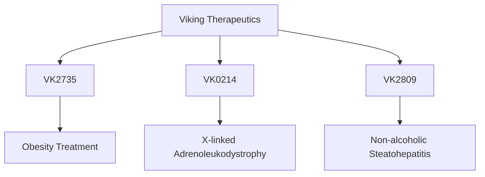

## 2. Company Overview
Viking Therapeutics, founded in 2012 and headquartered in San Diego, California, focuses on developing first-in-class or best-in-class therapies for metabolic and endocrine disorders. The company employs a capital-efficient business model, maintaining a lean organizational structure while advancing multiple clinical programs simultaneously.

**Key Facts:**
- Founded: 2012
- IPO: April 2015 (NASDAQ: VKTX)
- Employees: ~50 (primarily R&D focused)
- CEO: Brian Lian, Ph.D. (since 2012)
- Strategy: Development of novel therapeutics for metabolic and endocrine disorders

**Leadership Team:**
- Brian Lian, Ph.D. - CEO & Director
- Greg Zante - CFO
- Marianne Mancini - COO
- Michael Morneau - VP, Finance & Administration

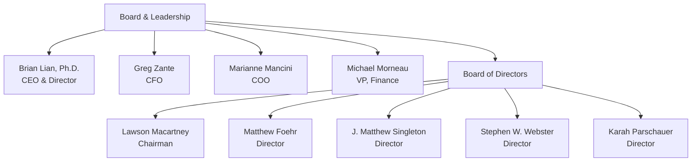

## 3. Pipeline Analysis
Viking's pipeline consists of three key programs, each addressing significant unmet medical needs:

### VK2735 (Obesity Program)
- **Mechanism:** Dual GLP-1/glucagon receptor agonist
- **Formulations:** Subcutaneous injection and oral
- **Status:** 
  - Subcutaneous: Phase 1 completed with positive results
  - Oral: Phase 1 ongoing
- **Key Data:** Demonstrated significant weight loss in Phase 1 trials

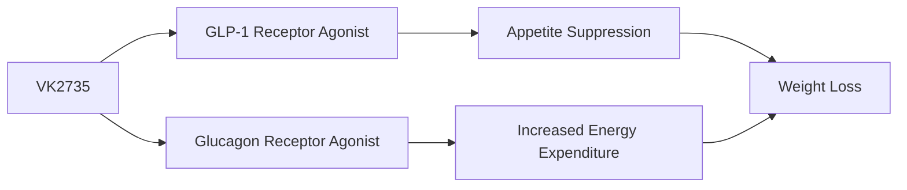

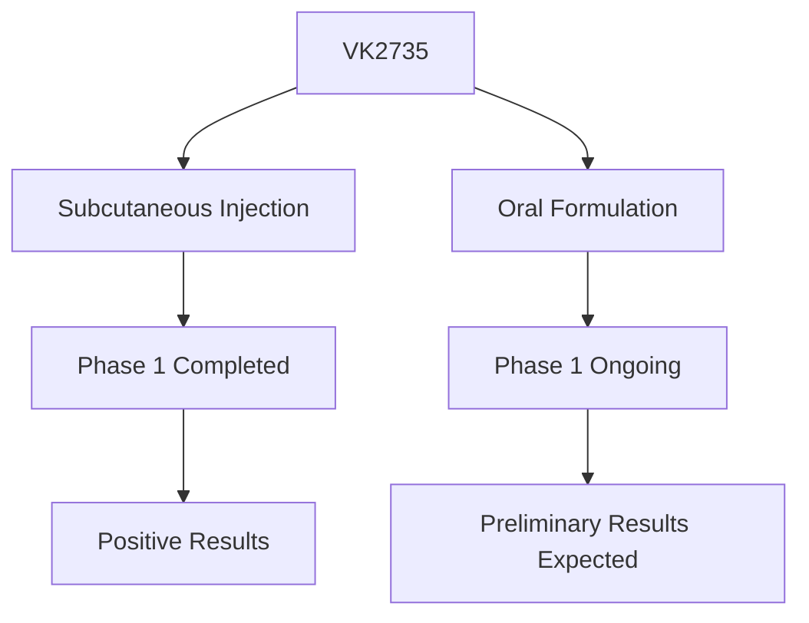

### VK0214 (X-ALD Program)
- **Mechanism:** Thyroid hormone beta receptor agonist
- **Target Indication:** X-linked Adrenoleukodystrophy (X-ALD)
- **Status:** Phase 1b ongoing
- **Designation:** Orphan Drug Designation from FDA
- **Key Data:** Demonstrated potential to reduce VLCFA (very long-chain fatty acid) levels

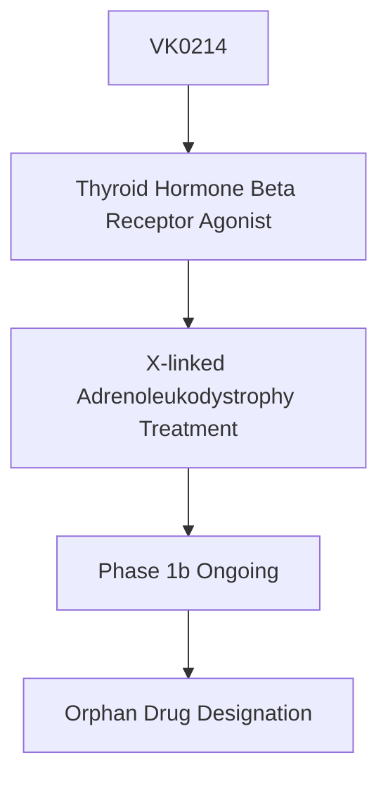

### VK2809 (NASH Program)
- **Mechanism:** Thyroid hormone beta receptor agonist
- **Target Indication:** Non-alcoholic Steatohepatitis (NASH)
- **Status:** Phase 2b completed
- **Key Data:** Demonstrated significant liver fat reduction and improvement in multiple biomarkers

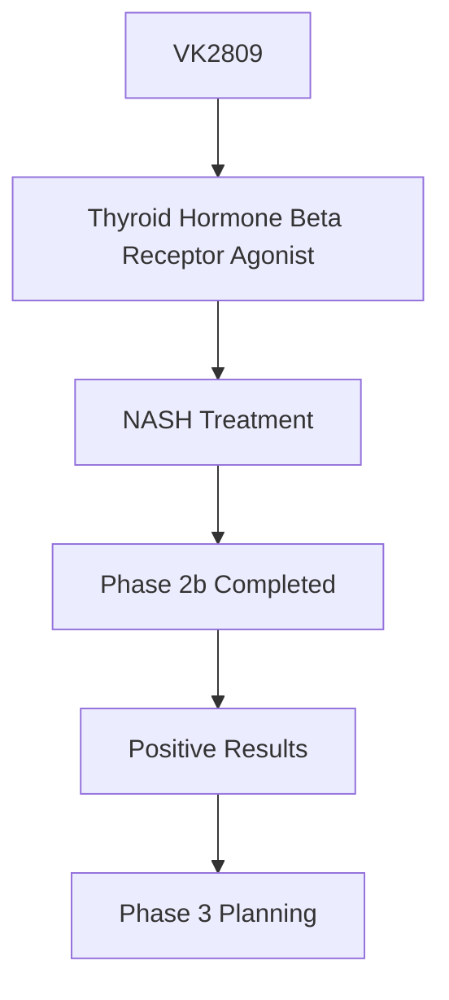

### Comprehensive Pipeline Timeline

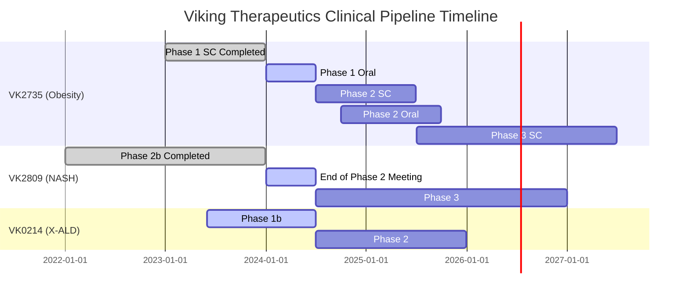

## 4. Market Opportunity
Viking's pipeline targets substantial market opportunities across multiple therapeutic areas:

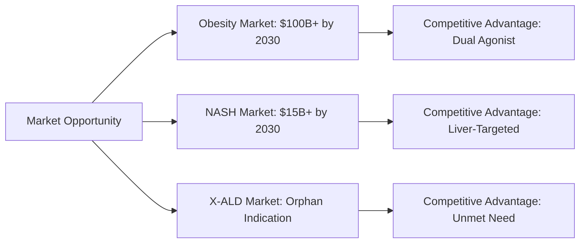

### Obesity Market
- Estimated to reach >$100 billion globally by 2030
- Affects over 650 million adults worldwide
- Current treatments: GLP-1 agonists (Wegovy, Saxenda) and dual GLP-1/GIP agonist (Zepbound)
- VK2735's potential advantages: 
  * Dual mechanism (GLP-1/glucagon)
  * Both subcutaneous and oral formulations
  * Potentially enhanced weight loss

### NASH Market
- Estimated to reach >$15 billion globally by 2030
- Affects approximately 5% of global population
- Limited approved treatments (Rezdiffra recently approved)
- VK2809's potential advantages:
  * Liver-targeted approach
  * Demonstrated significant liver fat reduction
  * Favorable safety and tolerability profile

### X-ALD Market
- Rare disease affecting approximately 1 in 17,000 births
- Significant unmet medical need
- Current treatments limited to supportive care and stem cell transplantation for cerebral form
- VK0214's potential advantage: Novel mechanism targeting underlying disease pathophysiology

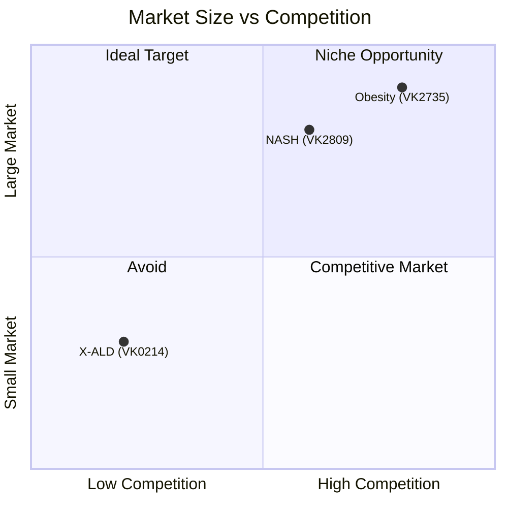

## 5. Competitive Landscape

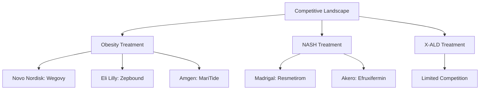

### Obesity Treatment Landscape
- **Major Competitors:** 
  * Novo Nordisk (Wegovy, Saxenda)
  * Eli Lilly (Zepbound)
  * Amgen (MariTide in development)
  * Pfizer, Roche, Structure Therapeutics (early stage)
- **VK2735 Differentiation:**
  * Dual mechanism targeting both appetite and energy expenditure
  * Potential for oral formulation
  * Early data suggesting strong efficacy

### NASH Treatment Landscape
- **Major Competitors:**
  * Madrigal (Resmetirom - first approved therapy)
  * Akero (Efruxifermin - late-stage)
  * 89bio (Pegozafermin - late-stage)
  * Numerous others in earlier development
- **VK2809 Differentiation:**
  * Liver-targeted mechanism
  * Significant reduction in liver fat in clinical trials
  * Favorable safety profile

### X-ALD Treatment Landscape
- **Limited Competition:**
  * bluebird bio (Skysona - gene therapy for cerebral form)
  * Minoryx (Leriglitazone - in development)
  * Standard of care: Lorenzo's oil (limited efficacy), stem cell transplant
- **VK0214 Differentiation:**
  * Novel mechanism addressing fundamental disease pathology
  * Potential for broader application across disease spectrum

```mermaid
radar
    title Competitive Positioning
    vectorWidth 2
    axisType logarithmic
    xAxisMaxValue 0.6
    legend yes
    colorRange "blue,red,green"
    
    attribute "Efficacy"
    attribute "Safety Profile"
    attribute "Convenience"
    attribute "Development Stage"
    attribute "Market Potential"
    
    series "VK2735 (Obesity)"
    series "VK2809 (NASH)"
    series "VK0214 (X-ALD)"
    
    "VK2735 (Obesity)" 0.45 0.50 0.40 0.35 0.55
    "VK2809 (NASH)" 0.40 0.45 0.35 0.40 0.45
    "VK0214 (X-ALD)" 0.35 0.50 0.30 0.30 0.25
```

## 6. Financial Analysis

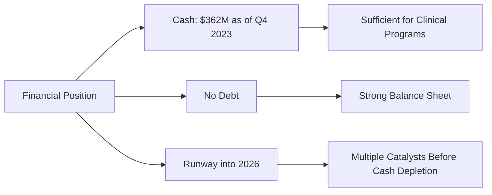

**Key Financial Metrics:**
- Cash and Investments: $362M (Q4 2023)
- Quarterly Burn Rate: ~$15-20M
- Estimated Runway: Into 2026
- Debt: None
- Market Capitalization: ~$7B

**Financial Strengths:**
- Strong cash position relative to development stage
- No debt burden
- Sufficient runway to achieve multiple value-creating milestones
- Capital-efficient business model

**Financial Considerations:**
- Increasing burn rate expected with Phase 3 trials
- Potential need for additional financing for commercialization
- Partnership opportunities could provide non-dilutive funding

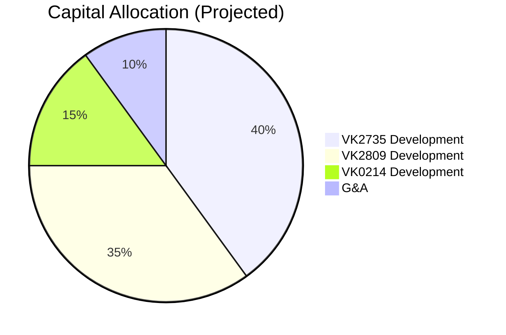

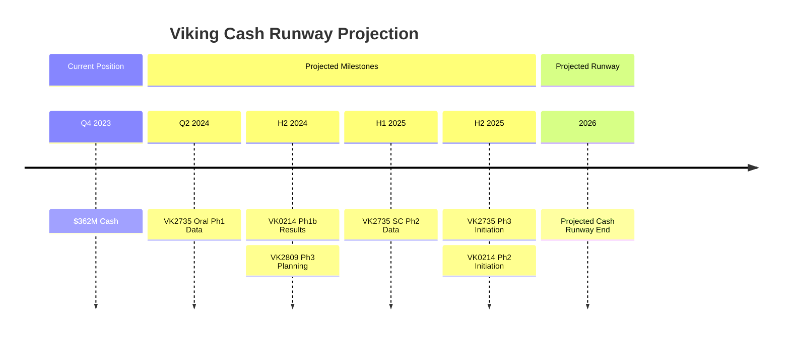

## 7. Catalysts & Timeline

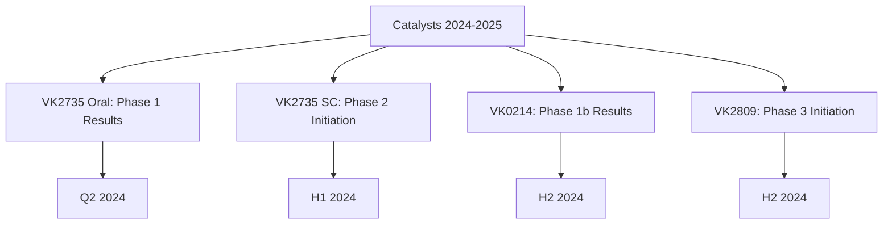

**Near-Term Catalysts (2024):**
- Q2 2024: VK2735 Oral Formulation Phase 1 Results
- H1 2024: VK2735 Subcutaneous Phase 2 Initiation
- H2 2024: VK0214 Phase 1b Results (X-ALD)
- H2 2024: VK2809 Phase 3 Planning/Initiation (NASH)

**Medium-Term Catalysts (2025-2026):**
- H1 2025: VK2735 Subcutaneous Phase 2 Data
- H2 2025: VK2735 Phase 3 Initiation
- H1 2026: VK0214 Phase 2 Data
- H2 2026: VK2809 Phase 3 Interim Analysis

**Longer-Term Milestones (2026+):**
- 2026-2027: Potential NDA Filing for VK2735 (Obesity)
- 2027-2028: Potential NDA Filing for VK2809 (NASH)
- 2027-2028: Potential NDA Filing for VK0214 (X-ALD)

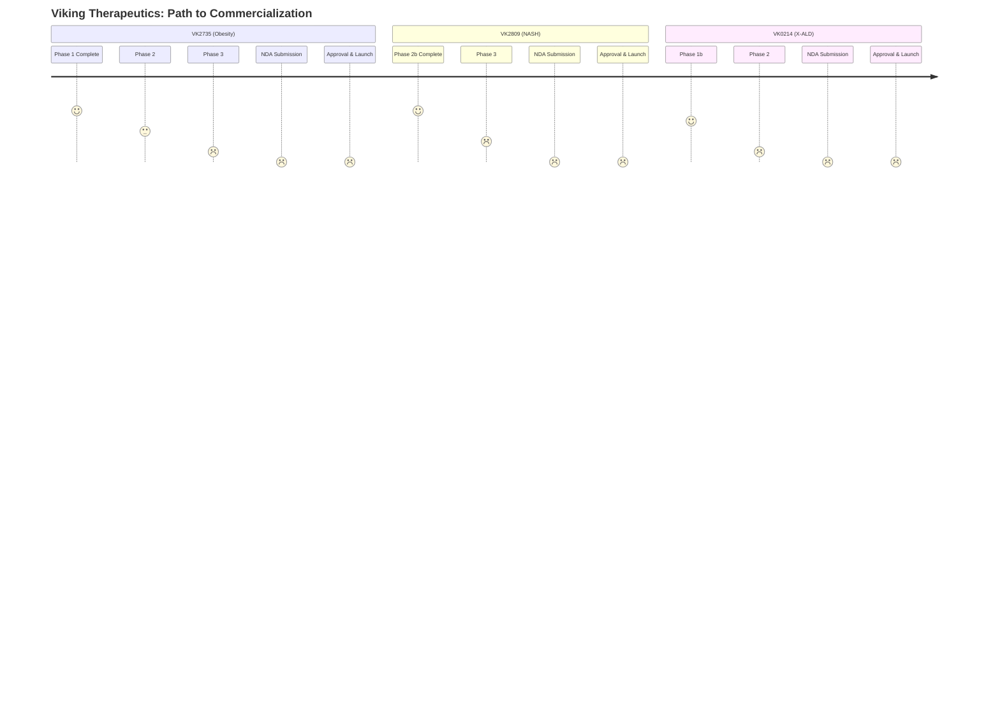

## 8. Risk Assessment

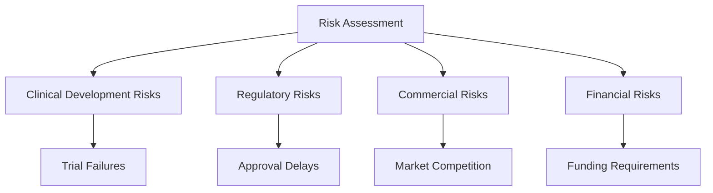

**Clinical Development Risks:**
- Failure to demonstrate efficacy in pivotal trials
- Safety/tolerability issues emerging in larger trials
- Patient recruitment challenges
- Execution delays affecting timelines

**Regulatory Risks:**
- Evolving regulatory landscape for metabolic disorders
- Potential for additional safety studies required by FDA
- Challenges in clinical trial design for NASH endpoints
- Comparative effectiveness requirements

**Commercial Risks:**
- Intense competition in obesity and NASH markets
- Pricing and reimbursement challenges
- Manufacturing scale-up difficulties
- Market access barriers

**Financial Risks:**
- Capital requirements for Phase 3 programs
- Potential need for additional financing
- Dilution from future equity raises
- Cash runway constraints

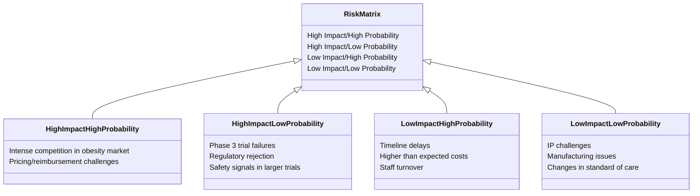

## 9. Valuation & Investment Thesis

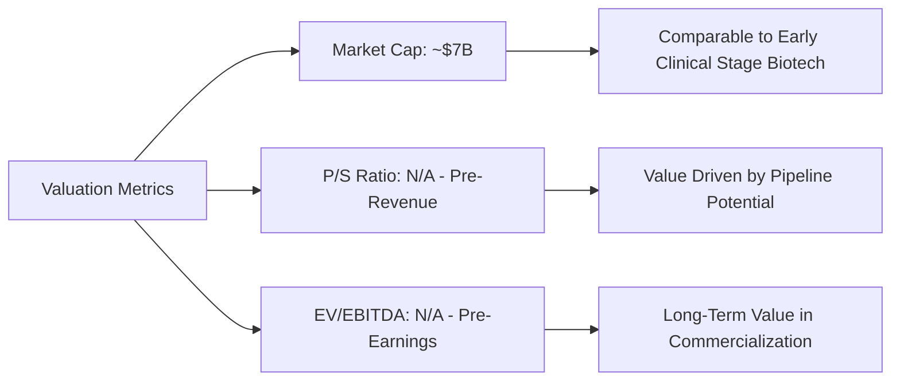

**Valuation Considerations:**
- Pre-revenue biotech with value driven by pipeline potential
- Current market cap (~$7B) reflects positive clinical data and market opportunities
- Comparable companies: Other mid-to-late stage metabolic disease companies
- Sum-of-parts valuation based on probability-adjusted NPV of each program

**Peer Comparison:**
- Obesity/metabolic focused companies: Novo Nordisk, Eli Lilly (large pharma)
- NASH focused companies: Madrigal, Akero, 89bio
- Early-stage biotech with multiple assets: Turning Point, Revolution Medicines

**Investment Thesis:**

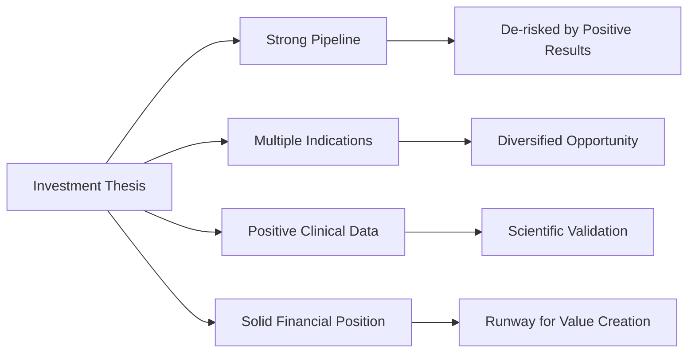

**Bull Case:**
- VK2735 demonstrates best-in-class efficacy in obesity
- VK2809 succeeds in Phase 3 NASH trials
- VK0214 demonstrates efficacy in X-ALD
- Multiple approvals lead to significant revenue streams
- Potential for partnership or acquisition at premium

**Bear Case:**
- Phase 3 trials fail to replicate early efficacy
- Intense competition limits market potential
- Regulatory hurdles delay or prevent approvals
- Capital requirements exceed current resources
- Market sentiment shifts away from biotech sector

## 10. Strategic Opportunities

**Partnership Potential:**
- VK2735 (Obesity): Partnership with large pharma for commercialization
- VK2809 (NASH): Co-development deal to share Phase 3 costs
- VK0214 (X-ALD): Rare disease company partnership for commercialization
- Geographic partnerships (ex-US rights)

**M&A Considerations:**
- Attractive acquisition target for:
  * Large pharma seeking to enter obesity/NASH markets
  * Mid-size pharma looking to expand metabolic portfolio
  * Specialty pharma targeting rare disease opportunities

**Strategic Alternatives:**
- Build commercial infrastructure (focus on specialty markets)
- License commercial rights while retaining development
- Hybrid approach with selective commercialization

```mermaid
mindmap
    root((Strategic Options))
        Partnership
            VK2735 Commercial Partnership
                Large Pharma
                Regional Deals
            VK2809 Co-Development
                Cost/Risk Sharing
                Expertise Access
            VK0214 Rare Disease Partner
                Specialized Commercial
        M&A
            Complete Acquisition
                Large Pharma Buyer
                Premium Valuation
            Asset Sale
                Individual Program
                Partial Rights
        Independent Path
            Build Commercial Infrastructure
                Specialty Focus
                Staged Approach
            Hybrid Model
                Self-Commercialize X-ALD
                Partner Obesity/NASH
```

## 11. Documentation & Sources
Key sources for this due diligence report include:
- Company SEC filings (10-K, 10-Q, 8-K)
- Corporate presentations and press releases
- Clinical trial publications and conference presentations
- Analyst reports and industry publications
- Market research on obesity, NASH, and rare disease markets
