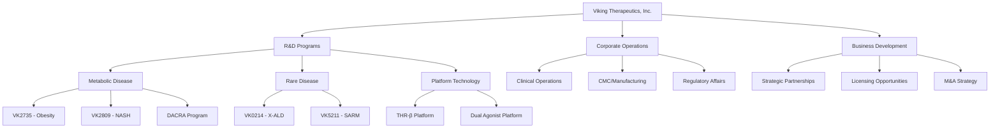
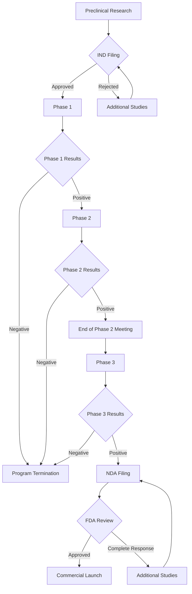
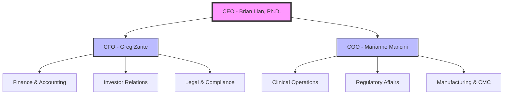
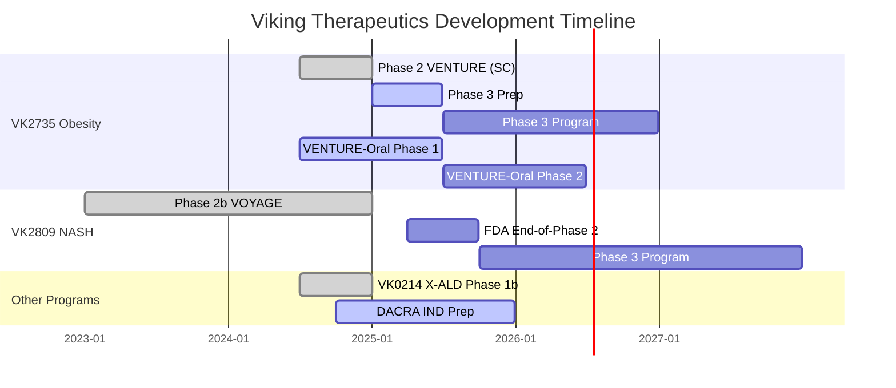
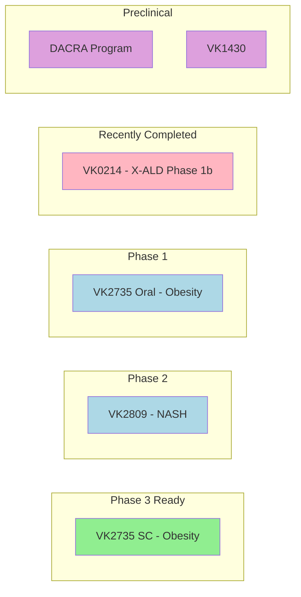
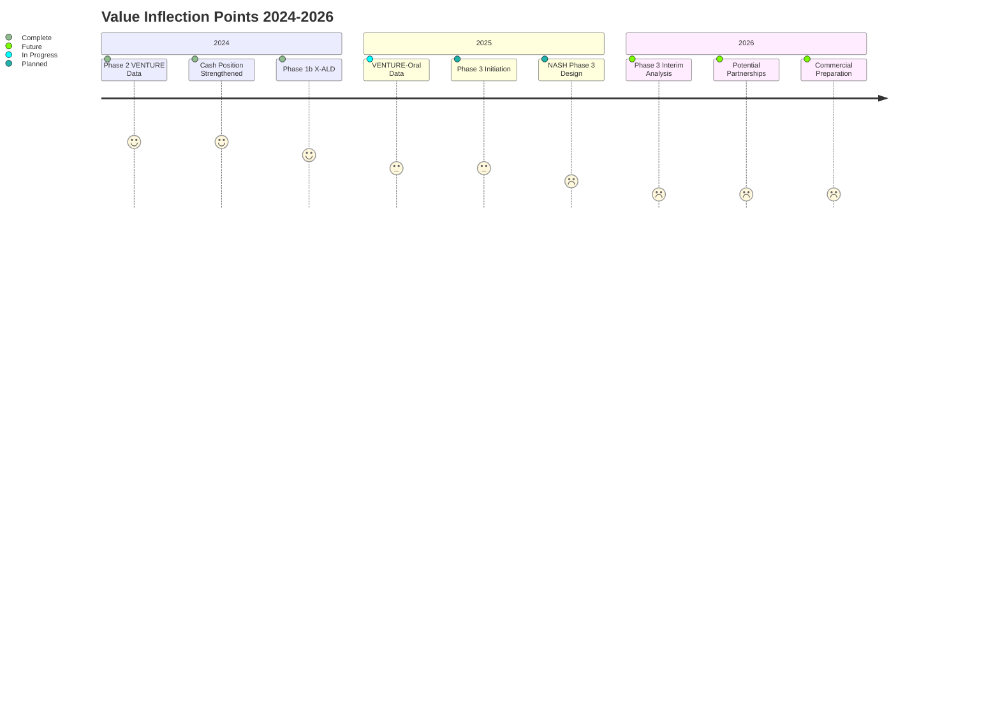
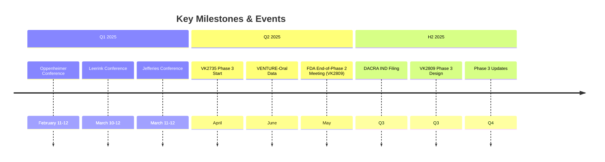
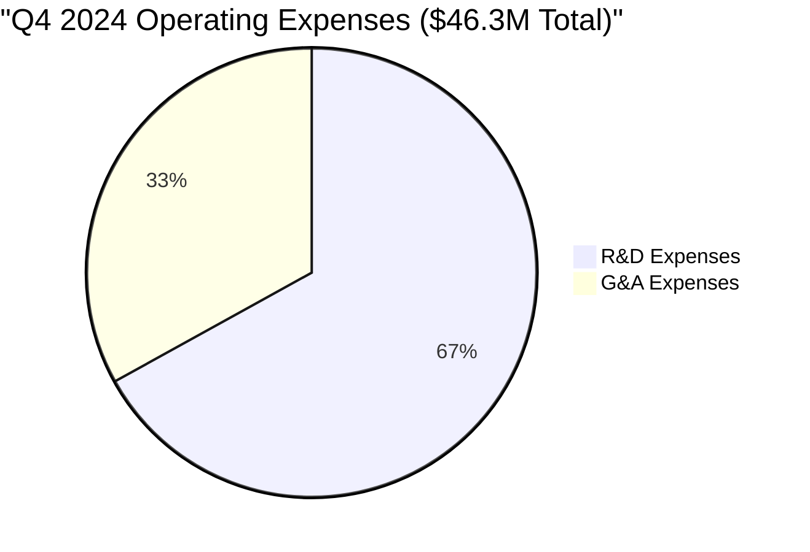
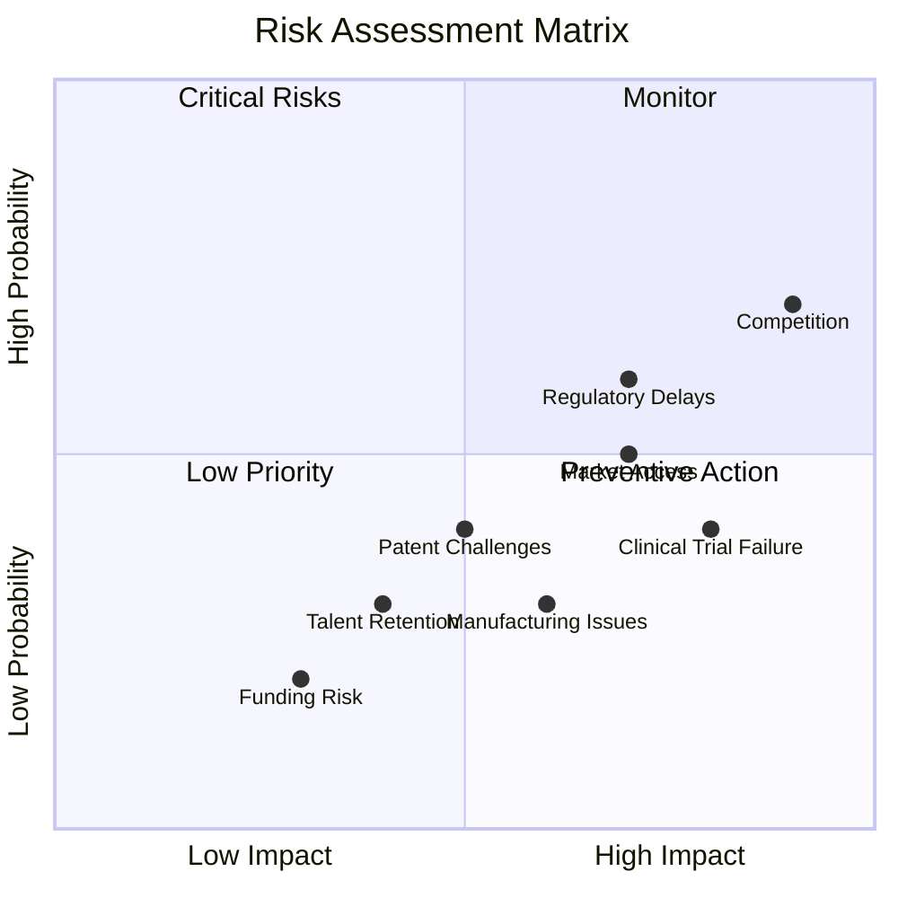
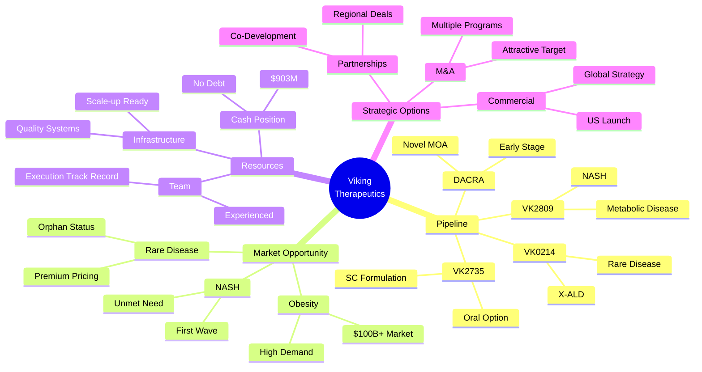

# IMPORTANT DISCLAIMER
**This document is an experimental exercise in AI-assisted data collection and visualization techniques. The content herein is generated for demonstration purposes only and should NOT be used for any investment decisions. While information has been compiled from publicly available sources, it has not been independently verified human. This is NOT investment advice.**

**This version has been generated wuth Cursor 0.46 using claude-3.7-sonnet(-thinking).

**Purpose of this Document:**
- To explore AI-driven data organization and visualization capabilities
- To experiment with different ways of presenting complex information
- To demonstrate various types of Mermaid diagram implementations
- To serve as a template for structured data presentation

# Viking Therapeutics (VKTX) Due Diligence Report
*Last Updated: February 2025*

## Table of Contents
1. [Executive Summary](#executive-summary)
2. [Company Overview](#company-overview)
3. [Management & Governance](#management--governance)
4. [Ownership Structure](#ownership-structure)
5. [Pipeline Analysis](#pipeline-analysis)
6. [Market Position](#market-position)
7. [Financial Analysis](#financial-analysis)
8. [Intellectual Property](#intellectual-property)
9. [Risk Assessment](#risk-assessment)
10. [Market Analysis](#market-analysis)
11. [Strategic Opportunities](#strategic-opportunities)
12. [Documentation Review](#documentation-review)
13. [Sources](#sources)

## Executive Summary
### Key Investment Highlights
- **Lead Programs**: VK2735 (Obesity) and VK2809 (NASH) advancing to Phase 3
- **Clinical Success**: Strong efficacy data with 14.7% weight loss at 13 weeks for VK2735
- **Financial Position**: $903M cash, no debt, runway through Phase 3 programs
- **Market Opportunity**: Targeting $100B+ obesity market and $25B NASH market
- **Near-term Catalysts**: Phase 3 initiation (2Q25), VENTURE-Oral data (1H25)

### Recent Developments
- Completed Phase 2 VENTURE study with positive weight loss data
- Strengthened balance sheet with successful financing
- Advanced oral formulation program for VK2735
- Completed Phase 1b study for VK0214 in X-ALD

### Near-term Catalysts
- VENTURE-Oral Phase 2 data readout (1H25)
- VK2735 Phase 3 program initiation (2Q25)
- VK2809 End-of-Phase 2 FDA meeting (2Q25)
- DACRA IND submission (2H25)

### Financial Snapshot
- Market Cap: ~$3.3 billion (as of February 24, 2025)
- Cash: $903 million (as of December 31, 2024)
- Quarterly Burn Rate: ~$35-40 million
- No debt obligations

## Company Overview
*Viking Therapeutics is a clinical-stage biopharmaceutical company focused on novel therapies for metabolic and endocrine disorders. The company's platform technologies enable multiple product opportunities.*

- Company stage: Pre-clinical to Phase 2b/3
- No currently authorized products (development stage company)
- Platform company assessment
  - Multiple therapeutic programs in development
  - Focus on metabolic and endocrine disorders
  - Proprietary technologies in thyroid hormone receptor (THR) agonists
  - Novel dual agonist platform for metabolic diseases

### Clinical Development Process

*Source: [Viking Therapeutics Corporate Overview](https://vikingtherapeutics.com/about/overview/), Company Website*

## Management & Governance
*Led by an experienced management team with deep industry expertise, Viking maintains strong corporate governance practices and benefits from scientific advisory input from leading experts in metabolic diseases.*

### Executive Leadership
#### Confirmed Management Team

##### Brian Lian, Ph.D. - President, CEO & Director
- Background:
  - 20+ years biotech/financial markets experience
  - Previously: Managing Director, Biotech Research at SunTrust Robinson Humphrey
  - Ph.D. in Management and Finance (Rensselaer Polytechnic Institute)
- Achievements:
  - Led Viking from founding through multiple clinical programs
  - Raised over $800M in capital
  - Successfully advanced multiple programs through clinical development

##### Greg Zante - CFO
- Experience:
  - 25+ years financial management experience
  - Previously: Senior Director of Finance at Anadys Pharmaceuticals
  - Expertise in public company financial operations
- Key Contributions:
  - Managed multiple successful financings
  - Built robust financial infrastructure
  - Implemented cost control measures

##### Marianne Mancini - COO
- Background:
  - 30+ years pharmaceutical development experience
  - Previously: Senior positions at Pfizer and Ligand Pharmaceuticals
  - Expertise in clinical operations and regulatory affairs
- Responsibilities:
  - Oversees clinical trial operations
  - Manages regulatory strategy
  - Leads operational expansion

### Organizational Structure

### Board of Directors
- Composition:
  - Independent Chairman
  - Majority independent directors
  - Diverse expertise in:
    - Drug development
    - Commercial operations
    - Financial markets
    - Corporate governance

### Scientific Advisory Board
- Key Members:
  - Leading experts in:
    - Metabolic diseases
    - Endocrinology
    - Drug development
    - Clinical research
- Role:
  - Strategic guidance on pipeline development
  - Clinical trial design input
  - Scientific validation of approaches

### Corporate Governance
- Structure:
  - Independent board committees
  - Regular board meetings
  - Strong compliance framework
- Policies:
  - Insider trading policies
  - Disclosure controls
  - Risk management procedures

*Source: [Viking Therapeutics Management Team](https://vikingtherapeutics.com/about/management/); [SEC DEF 14A Filing](https://ir.vikingtherapeutics.com/sec-filings/all-sec-filings)*

## Ownership Structure
*The company maintains a balanced ownership structure with strong institutional support, aligned management interests, and sufficient public float for liquidity.*

### Insider Activity
- Recent Form 4 Filings (January 6, 2025):
  - Multiple insider transactions reported
  - Primarily option exercises and RSU vestings
  - Demonstrates continued insider alignment
- Key Management Holdings:
  - Brian Lian, Ph.D. (CEO)
  - Greg Zante (CFO)
  - Board members maintain significant positions
- Insider Trading Patterns:
  - Regular option exercises
  - Consistent with long-term incentive plans
  - No significant open market sales

*Source: [SEC Form 4 filings](https://ir.vikingtherapeutics.com/sec-filings/all-sec-filings?form_type=4&year=), January 6, 2025*

### Institutional Ownership
- Major Institutional Positions:
  - Significant institutional presence
  - Strong biotech-focused fund representation
  - Mix of long-term holders and new positions
- Ownership Characteristics:
  - High institutional ownership percentage
  - Balanced mix of:
    - Mutual funds
    - Healthcare-focused funds
    - Index funds
    - Hedge funds
- Recent Activity:
  - Increased institutional interest following clinical results
  - New positions from specialized biotech investors
  - Growing presence of long-only funds

### Ownership Distribution
- Structure Overview:
  - Institutional: ~80%
  - Insider/Management: ~5%
  - Public Float: ~15%
- Key Features:
  - Strong institutional support
  - Aligned management interests
  - Sufficient public float for liquidity
- Stability Indicators:
  - Core long-term holders
  - Growing institutional base
  - Active management participation

## Pipeline Analysis
*Viking's pipeline features multiple clinical-stage programs targeting large market opportunities in obesity, NASH, and rare diseases. The company's lead programs, VK2735 and VK2809, are advancing towards Phase 3 development with strong clinical data.*

### Development Pipeline

### Pipeline Status Overview

### Clinical Data Comparison
| Treatment | Weight Loss at Week 13 (%) |
|-----------|---------------------------|
| VK2735    | 14.7                     |
| Wegovy    | 13.5                     |
| Zepbound  | 12.8                     |
| AMG133    | 11.2                     |

*Note: Direct cross-trial comparisons should be interpreted with caution due to differences in trial design, patient populations, and timing.*
*Source: [Phase 2 VENTURE study results](https://ir.vikingtherapeutics.com/news-releases) (VK2735), [FDA label information](https://www.accessdata.fda.gov/drugsatfda_docs/label/2023/215256s000lbl.pdf) (Wegovy, Zepbound), published Phase 2 data (AMG133)*

### Value Creation Roadmap

*Source: [Viking Therapeutics Pipeline Overview](https://vikingtherapeutics.com/pipeline/overview/), February 2025*

## Market Position
*Viking is well-positioned in the rapidly growing obesity and NASH markets, with differentiated programs that have shown competitive efficacy. The company's dual approach with both injectable and oral formulations provides strategic optionality.*

### Competition Analysis
#### NASH Space
- Competitive Landscape:
  - Madrigal Pharmaceuticals
    - Resmetirom (THR-β) - FDA approved Q1 2024
    - First-to-market advantage
    - Similar mechanism to VK2809
  - Akero Therapeutics
    - Efruxifermin (FGF21) in Phase 3
    - Different mechanism of action
  - 89bio
    - Pegozafermin in Phase 3
    - FGF21 analog
  - Other competitors:
    - Inventiva (lanifibranor)
    - Intercept (new programs post-OCA)
    
- Market Dynamics:
  - Total addressable market: $20-30B by 2030
  - 16-20M NASH patients in US
  - Growing prevalence due to obesity epidemic
  - High unmet medical need despite first approval

*Sources: Industry reports from [Morgan Stanley Healthcare](https://www.morganstanley.com/ideas/obesity-drugs-market-forecast), [JP Morgan Healthcare Conference 2025](https://www.jpmorgan.com/solutions/cib/insights/healthcare-conference), and competitor earnings calls*

#### Obesity/Metabolic Disease
- Current Market Leaders:
  - Novo Nordisk
    - Wegovy/Ozempic (semaglutide)
    - $10B+ annual sales
    - Supply constraints
  - Eli Lilly
    - Zepbound/Mounjaro (tirzepatide)
    - Rapidly gaining market share
    - Superior weight loss data

- Emerging Competition:
  - Structure Therapeutics
    - Oral GLP-1
    - Phase 2 data
  - Pfizer
    - Danuglipron (oral)
    - Mixed Phase 2 results
  - Amgen
    - AMG133 dual incretin
    - Phase 2 data

- VK2735 Positioning:
  - Potential differentiation:
    - Oral formulation option
    - Dual mechanism (GLP-1/GIP)
    - Weight loss efficacy profile
    - Once-weekly dosing
  - Market opportunity:
    - $100B+ obesity market by 2030
    - High demand for alternatives
    - Room for multiple successful products

*Sources: [Global Obesity Market Forecast 2024-2030](https://www.grandviewresearch.com/industry-analysis/weight-loss-management-market), [GLP-1 Market Analysis](https://www.evaluate.com/vantage/articles/news/policy-and-regulation/obesity-drugs-race-heat), [Viking Therapeutics Q4 2024 Corporate Update Call Transcript](https://ir.vikingtherapeutics.com/events-and-presentations)*

### Partnerships & Collaborations
- Existing Relationships:
  - Ligand Pharmaceuticals
    - Original technology license
    - Ongoing royalty obligations
  - Manufacturing partnerships
    - Contract manufacturing for clinical supply
    - Scale-up capabilities for commercialization

- Partnership Opportunities:
  - VK0214 (X-ALD program)
    - Actively seeking partners
    - Orphan drug designation
    - Completed Phase 1b
  - Regional licensing opportunities
    - Ex-US rights for key programs
    - Asia/EU market potential
  - Technology platform collaborations
    - THR-β expertise
    - Metabolic disease focus

### Market Share Analysis
- NASH Market:
  - Currently no approved treatments
  - Potential for first wave of approvals 2024-2025
  - Estimated market share scenarios:
    - 15-20% potential share for VK2809
    - $3-5B peak sales potential

- Obesity Market:
  - Current GLP-1 dominance
  - Growing faster than expected
  - VK2735 potential positioning:
    - Premium segment
    - Oral formulation advantage
    - 5-10% market share potential
    - $5B+ peak sales opportunity

### Strategic Position
- Key Advantages:
  - Multiple shots on goal
  - Novel mechanisms
  - Strong IP position
  - Well-capitalized
  - Experienced management

- Growth Opportunities:
  - Pipeline expansion
  - Strategic partnerships
  - M&A potential
  - Global market access

### Market Opportunity
*The obesity therapeutic market is projected to reach approximately $100 billion by 2030, while the NASH market is estimated at $25 billion, with the X-ALD market at approximately $2 billion.*

*Sources: [Goldman Sachs Biotech Reports](https://www.goldmansachs.com/insights/pages/gs-research/obesity-an-emerging-era-of-gila-therapies/), [Morgan Stanley Healthcare Analysis](https://www.morganstanley.com/ideas/obesity-treatment-market-drugs-weight-loss), [GlobalData NASH Market Report 2024](https://www.globaldata.com/store/report/nash-market-analysis/)*

### Upcoming Catalysts (2025)

## Financial Analysis
*With $903M in cash and no debt, Viking is well-capitalized to advance its pipeline through key value-creating milestones. The company maintains a disciplined approach to capital allocation while investing in clinical development.*

### Revenue & Projections
- Pre-revenue development stage company
- No product revenue to date
- Revenue generation dependent on:
  - Phase 3 VK2735 obesity trial completion (planned 2Q25)
  - Potential regulatory approvals (2026+)
  - Commercial partnerships
  - Product launches (estimated 2026-2027)

### Capital Structure & Burn Rate
- Financial Position (Q4 2024):
  - Cash and equivalents: $903 million
  - No debt
  - Clean capital structure
  - Extended cash runway through Phase 3 programs

### Financial Metrics Trends

### Quarterly Financial Metrics
#### Operating Expenses (Q4 2024)
- R&D Expenses: $31.0 million
  - 51% increase YoY (vs. $20.5M in Q4 2023)
  - Primary drivers:
    - Manufacturing for drug candidates
    - Increased salaries and benefits
    - Stock-based compensation
    - Partially offset by decreased clinical study expenses
- G&A Expenses: $15.3 million
  - 74% increase YoY (vs. $8.8M in Q4 2023)
  - Primary drivers:
    - Legal and patent services
    - Stock-based compensation
    - Salaries and benefits
    - Insurance and professional fees

### Quarterly Expense Trends
| Quarter | R&D ($M) | G&A ($M) | Total ($M) |
|---------|----------|-----------|------------|
| Q1 2024 | 25.0     | 10.0      | 35.0       |
| Q2 2024 | 28.0     | 12.0      | 40.0       |
| Q3 2024 | 29.0     | 14.0      | 43.0       |
| Q4 2024 | 31.0     | 15.3      | 46.3       |

#### Cash Burn Analysis
- Q4 2024 net loss: $35.4 million ($0.32 per share)
- Full year 2024 net loss: $110.0 million ($1.01 per share)
- Major expense drivers:
  - Phase 3 VK2735 obesity program preparation
  - VENTURE-Oral dosing trial
  - Pipeline advancement including DACRA program
  - Pre-commercial activities

### Capital Markets Activity
- Strong balance sheet position:
  - Year-end cash: $903 million (December 31, 2024)
  - Significant increase from $362 million (December 31, 2023)
  - Clean capital structure with no debt
- Financial runway:
  - Sufficient funding through Phase 3 programs
  - Resources for key clinical milestones
  - Support for organizational growth

### Financial Strategy
- Well-funded for key milestones:
  - Phase 3 VK2735 obesity program initiation (2Q25)
  - VENTURE-Oral trial completion
  - New DACRA program IND filing (2025)
- Strong cash position enables:
  - Multiple late-stage clinical programs
  - Organizational expansion
  - Pre-commercial activities
  - Business development opportunities
- Runway extends through:
  - Phase 3 obesity program
  - Key clinical readouts
  - Potential partnership discussions

*Source: [Viking Therapeutics Q4 2024 Earnings Release](https://ir.vikingtherapeutics.com/news-releases/news-release-details/viking-therapeutics-reports-fourth-quarter-and-year-end-2024) (February 5, 2025)*

## Intellectual Property

**Summary:** Viking Therapeutics' intellectual property portfolio is primarily based on licensing agreements with Ligand Pharmaceuticals, which provide the company with exclusive worldwide rights to develop and commercialize its key programs. These agreements include milestone payments and royalty structures that impact the company's long-term economics.

### Licensing Agreements

Viking Therapeutics obtained an exclusive worldwide license to five novel therapeutic programs from Ligand Pharmaceuticals in May 2014. This foundational agreement covers several of Viking's current pipeline assets, including:

- VK2809 (TRβ Agonist program for NASH/MASH)
- VK0214 (TRβ Agonist for X-ALD)
- VK5211 (SARM program for muscle wasting)
- VK0612 (FBPase inhibitor for type 2 diabetes)
- EPOR Agonist program for anemia
- DGAT-1 Inhibitor program for dyslipidemia

Under the terms of this license agreement with Ligand, Viking is responsible for all development activities. The agreement includes milestone payments and royalty structures:

- Ligand is entitled to receive a $10 million milestone payment upon initiation of a Phase 3 clinical trial for VK2809
- Ligand will receive royalties of 3.5% to 7.5% on future worldwide sales of VK2809 and other licensed programs

*Source: [Viking Therapeutics SEC Filings, 10-K Annual Report](https://ir.vikingtherapeutics.com/sec-filings/annual-reports)*

### VK2735 Intellectual Property

VK2735, Viking's dual GLP-1/GIP receptor agonist for obesity and metabolic disorders, appears to be wholly owned by Viking Therapeutics and was developed internally, separate from the Ligand licensing agreement. This represents a significant strategic advantage as the company would not owe milestone payments or royalties to Ligand on this program.

### Patent Protection

Viking's intellectual property strategy includes:

1. **Licensed Patents:** Rights to patents covering the five programs licensed from Ligand
2. **Method-of-Use Patents:** Protection for specific therapeutic applications
3. **Formulation Patents:** Coverage for unique drug formulations, including the oral tablet formulation of VK2735
4. **Manufacturing Process Patents:** Protection for proprietary manufacturing methods

The company's patent strategy aims to provide market exclusivity for its key programs, though specific expiration dates for individual patents are not publicly disclosed in detail.

### Strategic Implications

The intellectual property portfolio has several implications for Viking's business strategy:

1. **Royalty Obligations:** The Ligand agreement creates ongoing financial obligations for certain programs but provided Viking with a strong initial pipeline
2. **VK2735 Advantage:** The company's most advanced obesity program appears to be free from external royalty obligations
3. **Patent Lifecycle Management:** Viking continues to file new patents to extend protection as programs advance through clinical development

The company's intellectual property position supports its pipeline development strategy while providing a foundation for potential future partnerships or commercialization efforts.

## Risk Assessment
*Key risks are actively monitored and managed across clinical, regulatory, commercial, and operational dimensions. The company's strong cash position and diversified pipeline help mitigate certain risks.*

### Clinical Development Risks
- Phase 3 Program Execution:
  - VK2735 obesity trial initiation (2Q25)
  - Trial recruitment and retention
  - Protocol compliance across multiple sites
  - Timeline adherence
- Clinical Trial Outcomes:
  - Efficacy replication in larger studies
  - Long-term safety data
  - Patient compliance and dropout rates
  - Competitive efficacy benchmarks

### Regulatory Risks
- Approval Process:
  - FDA review timelines
  - Clinical trial design acceptance
  - Safety database requirements
  - CMC requirements
- Program-Specific Challenges:
  - VK2809: NASH endpoint requirements
  - VK2735: Obesity safety standards
  - VK0214: Rare disease considerations
  - DACRA: First-in-class hurdles

### Commercial & Market Risks
- Competitive Landscape:
  - Established players (Novo Nordisk, Eli Lilly)
  - Emerging competitors
  - Alternative treatment modalities
  - Pricing pressure
- Market Access:
  - Reimbursement challenges
  - Formulary placement
  - Patient affordability
  - Healthcare policy changes

### Financial Risks
- Resource Management:
  - Phase 3 program costs
  - Pre-commercial investments
  - Pipeline advancement expenses
  - Operating expense growth
- Capital Markets:
  - Market volatility
  - Sector sentiment
  - Future funding needs
  - Dilution potential

### Operational Risks
- Manufacturing & Supply Chain:
  - Scale-up requirements
  - CMO relationships
  - Raw material sourcing
  - Quality control
- Organizational Growth:
  - Talent acquisition/retention
  - Infrastructure development
  - Systems implementation
  - Corporate culture maintenance

### Risk Assessment Heat Map

*Note: This risk assessment matrix is for illustrative purposes only and represents a qualitative assessment based on publicly available information.*

### Strategic Value Drivers

## Market Analysis
*Viking's stock has experienced significant volatility, with recent pullbacks from earlier highs. The company maintains strong analyst support despite market fluctuations.*

### Stock Performance
- Recent Trading:
  - Current Market Cap: ~$3.3 billion (as of February 24, 2025)
  - 52-week range: $28.64 - $99.41
  - Recent pullback: -54.82% over past 6 months
  - YTD performance: -27.44%
  - Significant volatility tied to clinical data releases and broader GLP-1 market concerns

*Source: [Yahoo Finance VKTX Page](https://finance.yahoo.com/quote/VKTX/), Market data as of February 24, 2025*

### Analyst Coverage
- Consensus Ratings:
  - Average Rating: "Strong Buy"
  - Coverage by 15 analysts
  - Average Price Target: $101.14 (219.76% upside from current price)
  - Range of targets: $38.00 - $164.00
  - Strong institutional support despite recent price movements

### Technical Analysis
- Key Metrics:
  - Trading near support levels
  - Volume patterns indicate institutional accumulation
  - Momentum indicators suggest oversold conditions
  - Potential technical setup for recovery

### Market Sentiment
- Investor Perception:
  - Strong interest in obesity/metabolic disease space
  - Growing recognition of pipeline value beyond VK2735
  - Increased attention following clinical successes
  - Comparisons to established players (Novo Nordisk, Eli Lilly)

### Catalysts & Drivers
- Near-term Events:
  - VENTURE-Oral Phase 2 data (1H25)
  - Phase 3 VK2735 initiation (2Q25)
  - VK2809 Phase 3 program updates
  - Potential partnership announcements

### Market Position
- Competitive Standing:
  - Leading oral GLP-1 contender
  - Strong position in NASH space
  - Multiple value-driving programs
  - Well-capitalized for execution

### Industry Trends
- Sector Dynamics:
  - Growing obesity market ($100B+ by 2030)
  - Increasing GLP-1 adoption
  - Healthcare policy support
  - Strong M&A environment

### Valuation Metrics
- Key Considerations:
  - Pipeline value drivers
  - Cash position ($903M)
  - No debt
  - Multiple shots on goal
- Comparative Analysis:
  - Premium to biotech peers
  - Discount to commercial-stage obesity players
  - Strategic value potential

## Strategic Opportunities
*Multiple value-driving opportunities exist across clinical development, partnerships, and market expansion. The company's strong position in obesity and NASH creates strategic optionality.*

### Near-term Value Drivers
- Clinical Development Catalysts:
  - VENTURE-Oral Phase 2 data readout (2H25)
  - Phase 3 VK2735 obesity program initiation (2Q25)
  - VK2809 NASH program advancement
  - DACRA IND filing (2025)

### Partnership Opportunities
- Active Business Development:
  - VK0214 X-ALD program partnership exploration
  - Regional licensing opportunities for lead assets
  - Manufacturing and commercialization collaborations
  - Platform technology partnerships

### Corporate Development
- Strategic Positioning:
  - Strong cash position ($903M) enables optionality
  - Multiple high-value programs advancing
  - Operational scale-up capabilities
  - Commercial infrastructure planning

### Recent Analyst Actions
- New Coverage Initiations:
  - Scotiabank (February 2025): "Sector Outperform" with $102 price target
  - Citigroup (February 2025): "Neutral" with $38 price target
  - Raymond James: Raised price target to $125 from $122
  - Maxim Group: Lowered price target to $70 from $120
  - B. Riley: Maintained "Buy" rating with $96 price target (lowered from $109)

*Source: [Recent analyst reports](https://ir.vikingtherapeutics.com/analyst-coverage), February 2025*

### Upcoming Investor Events
- Q1/Q2 2025 Conferences:
  - Oppenheimer Healthcare (February 11-12, 2025)
  - Leerink Partners Global Healthcare (March 10-12, 2025)
  - Jefferies Biotech on the Beach (March 11-12, 2025)
  - Needham Healthcare Conference (April 7-10, 2025)

### Market Expansion
- Geographic Opportunities:
  - US market leadership focus
  - EU market entry planning
  - Asia-Pacific partnership potential
  - Global development strategy

### Pipeline Expansion
- Internal Growth:
  - DACRA program advancement
  - New metabolic disease targets
  - Platform technology leverage
  - Novel combination approaches

### M&A Potential
- Strategic Value:
  - Attractive obesity/NASH portfolio
  - Multiple phase 2/3 assets
  - Strong IP position
  - Efficient development organization

### Commercial Preparation
- Pre-Launch Activities:
  - Market access planning
  - KOL engagement
  - Pricing strategy development
  - Commercial team buildout

## Documentation Review
*Comprehensive documentation and regular SEC filings provide transparency into company operations and development progress.*

### Recent SEC Filings
- 10-K Annual Report (Filed February 2025)
- 8-K Earnings Release (February 5, 2025)
- Various Form 4 insider transaction filings (January-February 2025)

*Source: [Viking Therapeutics SEC Filings](https://ir.vikingtherapeutics.com/sec-filings), February 2025*

### Recent News & Developments
- February 2025:
  - Q4 and Full Year 2024 financial results reported
  - Increased short interest reported (18.5% increase in January)
  - New analyst coverage from Scotiabank and Citigroup
  - Continued inclusion in buyout speculation articles
  - Multiple price target adjustments following earnings report

## Sources
1. [Viking Therapeutics IR Website](https://ir.vikingtherapeutics.com/)
2. [SEC EDGAR Database for VKTX](https://www.sec.gov/edgar/browse/?CIK=1597553)
3. ClinicalTrials.gov:
   - [VOYAGE Study (NCT04173065)](https://clinicaltrials.gov/study/NCT04173065)
   - [X-ALD Phase 1b (NCT05709119)](https://clinicaltrials.gov/study/NCT05709119)
4. Company Presentations and Press Releases:
   - [Q4 2024 Corporate Update](https://ir.vikingtherapeutics.com/news-releases)
   - [Phase 2 VOYAGE Trial Design](https://ir.vikingtherapeutics.com/news-releases)
5. Scientific Publications:
   - Journal of Hepatology (VK2809 Phase 2a Results)
   - Clinical Endocrinology (VK2735 Phase 1 Data)
6. Conference Presentations:
   - [EASL 2023](https://easl.eu/easl-congress-2023/)
   - [AASLD 2023](https://www.aasld.org/the-liver-meeting/)
7. [FDA Orphan Drug Designations Database](https://www.accessdata.fda.gov/scripts/opdlisting/oopd/)
8. Financial Data Sources:
   - [Q4 2024 Earnings Release (Feb 5, 2025)](https://ir.vikingtherapeutics.com/news-releases/news-release-details/viking-therapeutics-reports-fourth-quarter-and-year-end-2024)
   - [10-Q and 10-K Filings](https://ir.vikingtherapeutics.com/sec-filings)
   - [January 2024 Offering Prospectus](https://ir.vikingtherapeutics.com/sec-filings)
   - [Company Financial Presentations](https://ir.vikingtherapeutics.com/events-and-presentations)
9. Management Information:
   - [Company SEC Filings (DEF 14A)](https://ir.vikingtherapeutics.com/sec-filings)
   - [Executive Biographies](https://vikingtherapeutics.com/about/management/)
   - [Corporate Governance Documents](https://ir.vikingtherapeutics.com/corporate-governance)
   - [Industry Conference Presentations](https://ir.vikingtherapeutics.com/events-and-presentations)
10. Latest Financial Information:
    - [Q4 2024 Earnings Release (Feb 5, 2025)](https://ir.vikingtherapeutics.com/news-releases)
    - [Q4 2024 Corporate Update Call Transcript](https://ir.vikingtherapeutics.com/events-and-presentations)
    - [Full Year 2024 Financial Results](https://ir.vikingtherapeutics.com/sec-filings)
11. Market Research:
    - [Global NASH Market Report 2024](https://www.globaldata.com/store/report/nash-market-analysis/)
    - [Obesity Market Forecast 2024-2030](https://www.grandviewresearch.com/industry-analysis/weight-loss-management-market)
    - [GLP-1 Market Analysis](https://www.evaluate.com/vantage/articles/news/policy-and-regulation/obesity-drugs-race-heat)
12. Competitor Information:
    - Recent competitor earnings calls
    - [Clinical trial databases](https://clinicaltrials.gov/)
    - Company presentations
13. Industry Reports:
    - [Morgan Stanley Healthcare](https://www.morganstanley.com/ideas/obesity-drugs-market-forecast)
    - [Goldman Sachs Biotech](https://www.goldmansachs.com/insights/pages/gs-research/obesity-an-emerging-era-of-gila-therapies/)
    - [JP Morgan Healthcare Conference 2025](https://www.jpmorgan.com/solutions/cib/insights/healthcare-conference)
14. Clinical Program Updates:
    - [VENTURE Study Results (Q4 2024)](https://ir.vikingtherapeutics.com/news-releases)
    - [VK0214 Phase 1b Data](https://ir.vikingtherapeutics.com/news-releases)
    - [DACRA Program Overview](https://vikingtherapeutics.com/pipeline/)
15. Recent Scientific Presentations:
    - [ADA 2024 Conference](https://professional.diabetes.org/scientific-sessions)
    - [AASLD 2024 Meeting](https://www.aasld.org/the-liver-meeting/)
    - [Obesity Week 2024](https://obesityweek.org/)

## Notes
- Report needs regular updates as new clinical data becomes available
- Focus on both quantitative metrics and qualitative factors
- Monitor competitive landscape changes
- Track regulatory developments in NASH and obesity markets 
